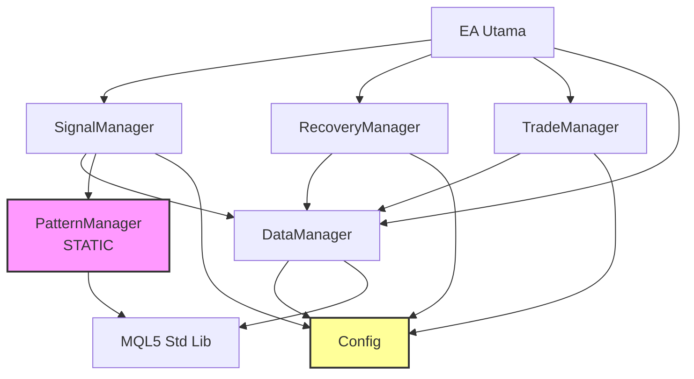

# PASR Framework - Arsitektur & Panduan Pengembangan

**Versi:** 1.30 (Production Ready)  
**Status:** Stabil, Optimized, SOLID Compliant  
**Target:** MQL5 Expert Advisors untuk Trading Otomatis

---

## 📋 Daftar Isi

1. [Filosofi Desain](#filosofi-desain)
2. [Arsitektur Layer](#arsitektur-layer)
3. [Diagram Dependensi](#diagram-dependensi)
4. [Detail Modul](#detail-modul)
5. [Alur Eksekusi](#alur-eksekusi)
6. [Manajemen Memori](#manajemen-memori)
7. [Sistem Event](#sistem-event)
8. [Panduan Pengembangan](#panduan-pengembangan)
9. [Best Practices](#best-practices)
10. [Common Pitfalls](#common-pitfalls)

---

## 🏛️ Filosofi Desain

PASR dibangun dengan prinsip-prinsip berikut:

### 1. **Separation of Concerns (SoC)**
Setiap modul memiliki satu tanggung jawab tunggal. Tidak ada "God Class".

### 2. **Dependency Injection via Interfaces**
Modul berkomunikasi melalui interface (`IDataProvider`, dll), bukan implementasi konkret.
- ✅ Loose coupling
- ✅ Mudah di-unit test dengan mock objects
- ✅ Swap implementation tanpa mengubah caller

### 3. **Static Utility Pattern**
Kelas yang tidak menyimpan state (seperti `PatternManager`) dibuat `static` untuk:
- Hemat memori (~400 bytes/symbol)
- Performa lebih tinggi (no virtual dispatch overhead)
- Thread-safe by design

### 4. **Centralized Configuration with Snapshot**
Konfigurasi disimpan dalam struct `ConfigSnapshot` yang di-copy secara atomik.
- ✅ Konsistensi data saat reload config
- ✅ Type-safe access
- ✅ No race conditions

### 5. **Event-Driven Architecture**
Komunikasi antar modul menggunakan event queue, bukan direct call.
- ✅ Decoupled execution
- ✅ Easy debugging & logging
- ✅ Scalable untuk multi-symbol

---

## 🏗️ Arsitektur Layer

```
┌─────────────────────────────────────────────────┐
│              LAYER 4: ORCHESTRATION             │
│  (EA Utama / Entry Point)                       │
│  - Menginisialisasi semua Manager               │
│  - Event Loop utama                             │
└─────────────────────────────────────────────────┘
                      ⬇️ uses
┌─────────────────────────────────────────────────┐
│              LAYER 3: BUSINESS LOGIC            │
│  - SignalManager (Keputusan Entry/Exit)         │
│  - RecoveryManager (Drawdown Protection)        │
│  - TradeManager (Order Execution)               │
└─────────────────────────────────────────────────┘
                      ⬇️ uses
┌─────────────────────────────────────────────────┐
│              LAYER 2: DATA & SERVICES           │
│  - DataManager (Market Data, Stats, Cache)      │
│  - PatternManager (Static Utils - Candlestick)  │
│  - Config (Global Settings Snapshot)            │
└─────────────────────────────────────────────────┘
                      ⬇️ uses
┌─────────────────────────────────────────────────┐
│              LAYER 1: INFRASTRUCTURE            │
│  - MQL5 Standard Library (CTrade, CArrayObj)    │
│  - Windows API (untuk timing, jika perlu)       │
└─────────────────────────────────────────────────┘
```

**Aturan Emas:**
- Layer N hanya boleh depend ke Layer N-1 atau di layer yang sama.
- **DILARANG:** Layer bawah memanggil Layer atas (No Upward Dependency).
- **DILARANG:** Circular dependency.

---

## 🔗 Diagram Dependensi



**Keterangan:**
- 🟪 **PatternManager**: Static utility class (tidak ada instance).
- 🟨 **Config**: Single source of truth untuk settings.

---

## 📦 Detail Modul

### 1. `1.Events.mqh`
- **Tanggung Jawab:** Definisi enum event dan struct `EventMessage`.
- **State:** Stateless (hanya definisi tipe data).
- **Thread Safety:** ✅ Safe (immutable definitions).
- **Jangan Ubah:** Enum value yang sudah ada (bisa break backward compatibility).

### 2. `2.Config.mqh`
- **Tanggung Jawab:** Definisi `struct Config` dan `ConfigSnapshot`.
- **Fitur Kunci:**
  - `ConfigSnapshot`: Immutable copy dari config saat ini.
  - `CopyFrom()/CopyTo()`: Atomic transfer data.
- **Akses:** Read-only untuk semua manager setelah inisialisasi.
- **Cara Extend:** Tambahkan field baru di struct `Config`, lalu update `CopyFrom/CopyTo`.

### 3. `3.Logger.mqh`
- **Tanggung Jawab:** Logging terpusat (File, Terminal, Email).
- **Thread Safety:** ✅ Safe (internal locking jika perlu).
- **Usage:** `Logger::Info("Message")`.

### 4. `4.Utils.mqh`
- **Tanggung Jawab:** Helper functions umum (Math, String, Time).
- **Pattern:** Static methods only.
- **Jangan Ubah:** Signature fungsi yang sudah dipakai di banyak tempat.

### 5. `5.SignalManager.mqh`
- **Tanggung Jawab:** Logika entry/exit signal.
- **Dependencies:** `DataManager`, `PatternManager` (static), `Config`.
- **State:** Menyimpan status signal per symbol.
- **Cara Extend:** Tambahkan strategi baru di method `Analyze()`.

### 6. `6.TradeManager.mqh`
- **Tanggung Jawab:** Eksekusi order (Open, Close, Modify).
- **Dependencies:** `DataManager`, `Config`.
- **Safety:** Validasi margin, slippage, dan lot size sebelum eksekusi.

### 7. `7.MoneyManager.mqh`
- **Tanggung Jawab:** Perhitungan lot size, risk management.
- **Dependencies:** `DataManager` (untuk balance/equity), `Config`.
- **Formula:** `Lot = (Risk% * Equity) / (StopLoss * TickValue)`.

### 8. `8.RecoveryManager.mqh`
- **Tanggung Jawab:** Proteksi drawdown, recovery mode.
- **Dependencies:** `DataManager`, `Config`.
- **Memory Management:** 
  - Menggunakan raw pointer array `RecoveryEngine*`.
  - **DESTRUCTOR WAJIB:** Menghapus semua pointer di `~RecoveryManager()`.
  - **Jangan Ubah:** Logika destructor tanpa pemahaman mendalam.

### 9. `9.PatternManager.mqh`
- **Tanggung Jawab:** Deteksi pola candlestick (Pinbar, Engulfing, dll).
- **Pattern:** **STATIC CLASS** (Tidak ada instance).
- **Usage:** `PatternManager::Detect(...)`.
- **Jangan Ubah:** Menjadi non-static (akan break memory optimization).

### 10. `10.DataManager.mqh`
- **Tanggung Jawab:** Sentralisasi data market, stats, dan cache config.
- **Interface:** Implementasi `IDataProvider`.
- **Fitur Kunci:**
  - `ConfigSnapshot` cache internal.
  - `GetATRPoints()`, `CanOpenTrade()`, dll.
- **Dependency Injection:** Bisa di-mock untuk testing.

---

## ⚡ Alur Eksekusi (Runtime Flow)

```
1. EA Init
   ├─ Load Config (2.Config.mqh)
   ├─ Init DataManager (10.DataManager.mqh)
   ├─ Init SignalManager (5.SignalManager.mqh)
   ├─ Init TradeManager (6.TradeManager.mqh)
   └─ Init RecoveryManager (8.RecoveryManager.mqh)

2. OnTick() Loop
   ├─ DataManager.UpdatePrices()
   ├─ SignalManager.Analyze() → Generate Signal?
   │   └─ If YES → EventQueue.Push(EVENT_SIGNAL)
   ├─ EventQueue.Process()
   │   ├─ EVENT_SIGNAL → TradeManager.Open()
   │   └─ EVENT_CLOSE → TradeManager.Close()
   └─ RecoveryManager.CheckDrawdown()

3. OnTimer() (Setiap 1 detik)
   └─ Logger.Flush()
   └─ RecoveryManager.SaveState()
```

---

## 💾 Manajemen Memori

### Aturan Wajib:
1. **Hindari `new` jika tidak perlu.** Gunakan stack allocation atau static.
2. **Jika pakai `new`, WAJIB `delete` di destructor.**
   - Contoh: `RecoveryManager` mengelola array `RecoveryEngine*`.
3. **PatternManager harus tetap STATIC.**
   - Alasan: Hemat memori & performa.
4. **ConfigSnapshot di-copy by value.**
   - Jangan simpan pointer ke Config asli (bisa berubah saat reload).

### Memory Layout per Symbol:
| Komponen | Ukuran | Keterangan |
|----------|--------|------------|
| SignalManager State | ~200 bytes | Status signal |
| TradeManager State | ~150 bytes | Open positions info |
| DataManager Cache | ~2.5 KB | Config snapshot + stats |
| **Total** | **~3 KB** | Sangat efisien |

---

## 📨 Sistem Event

### Event Types (`1.Events.mqh`):
- `EVENT_TICK`: Update harga baru.
- `EVENT_SIGNAL`: Signal entry/exit terdeteksi.
- `EVENT_ORDER_OPENED`: Order berhasil dibuka.
- `EVENT_ORDER_CLOSED`: Order ditutup.
- `EVENT_DRAWDOWN_WARNING`: Drawdown melebihi threshold.

### Cara Menambah Event Baru:
1. Tambahkan enum di `1.Events.mqh`.
2. Buat struct payload jika perlu data tambahan.
3. Register handler di modul yang bersangkutan.
4. **Jangan** hardcode event handling di EA utama (gunakan event queue).

---

## 🛠️ Panduan Pengembangan

### ✅ DO (Lakukan)
- [x] Gunakan interface `IDataProvider` untuk akses data.
- [x] Tambahkan unit test untuk logika bisnis baru.
- [x] Update versi file header (`//+-- version: 1.30 --+`).
- [x] Dokumentasikan perubahan di file ini.
- [x] Gunakan `ConfigSnapshot` untuk akses config.

### ❌ DON'T (Jangan)
- [ ] Membuat instance `PatternManager` (harus static!).
- [ ] Menghapus destructor di kelas yang punya pointer.
- [ ] Mengubah urutan include file (bisa break dependency).
- [ ] Akses global variables langsung (gunakan DataManager).
- [ ] Membuat circular dependency (Layer atas ↔ Layer bawah).

### 🧪 Testing Checklist
Sebelum commit, pastikan:
1. Compile tanpa error/warning di MetaEditor5.
2. Backtest 1000+ tick tanpa crash.
3. Memory usage stabil (tidak leak).
4. Event handling berjalan sesuai urutan.

---

## 🏆 Best Practices

### 1. Naming Convention
- **Class:** `PascalCase` (e.g., `SignalManager`)
- **Method:** `CamelCase` (e.g., `analyzeSignal()`)
- **Variable:** `m_` prefix untuk member (e.g., `m_config`)
- **Static Method:** Langsung panggil `Class::Method()`

### 2. Error Handling
- Selalu cek return value dari fungsi kritis (e.g., `OrderSend`).
- Log error dengan level yang sesuai (`ERROR`, `WARN`, `INFO`).
- Jangan silent fail!

### 3. Code Reuse
- Cek dulu di `Utils.mqh` atau `PatternManager.mqh` sebelum buat fungsi baru.
- Hindari duplikasi logika.

### 4. Performance
- Hindari loop besar di `OnTick()`.
- Gunakan cache di `DataManager` untuk data yang sering diakses.
- Minimalisasi alokasi memori dinamis di hot path.

---

## ⚠️ Common Pitfalls

### 1. Memory Leak di RecoveryManager
**Salah:**
```mql5
class RecoveryManager {
   RecoveryEngine *engines[];
   // Tidak ada destructor!
};
```
**Benar:**
```mql5
class RecoveryManager {
   RecoveryEngine *engines[];
   ~RecoveryManager() {
      for(int i=0; i<ArraySize(engines); i++) delete engines[i];
   }
};
```

### 2. Instance PatternManager
**Salah:**
```mql5
PatternManager pm;  // ❌ Buang memori percuma
pm.Detect();
```
**Benar:**
```mql5
PatternManager::Detect();  // ✅ Static call, no instance
```

### 3. Direct Config Access
**Salah:**
```mql5
double lot = GlobalConfig.LotSize;  // ❌ Bisa berubah mid-execution
```
**Benar:**
```mql5
ConfigSnapshot cfg = DataManager.GetConfigCache();
double lot = cfg.LotSize;  // ✅ Immutable snapshot
```

---

## 📞 Kontak & Kontribusi

Jika ingin menambahkan fitur baru:
1. Baca dokumen ini dengan teliti.
2. Buat branch baru di Git.
3. Pastikan semua test lolos.
4. Update dokumen ini jika ada perubahan arsitektur.
5. Submit Pull Request.

**Dijaga oleh:** Tim Pengembang PASR  
**Last Updated:** 2024 (v1.30)

---

> **Catatan Penting:** Dokumen ini adalah "Single Source of Truth" untuk arsitektur PASR. Setiap penyimpangan dari panduan ini harus didiskusikan terlebih dahulu untuk menjaga integritas sistem.
