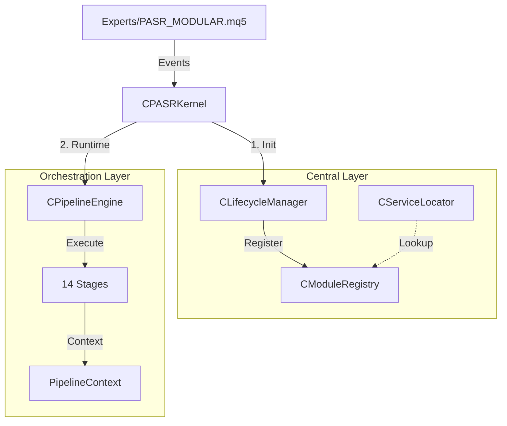

# PASR Architecture

PASR is an MQL5 Expert Advisor framework built around a centralized runtime kernel and a modular trading pipeline.

Current canonical entrypoint:

```mql5
#include <PASR/Core/PASR.mqh>

CPASRKernel kernel;
```

`CPASRKernel` owns lifecycle, service lookup, manager registry, runtime event flow, trade transaction routing, and pipeline execution. Legacy runtime compatibility adapters have been removed; new callers must use the kernel directly.

## 0. Visual System Overview


## 1. Structural Hierarchy

Arsitektur PASR dibagi menjadi tiga zona utama yang saling terisolasi namun terintegrasi:

### A. Central Layer (The Brain)
- **`CPASRKernel`**: Facade utama. Mengelola event loop dan delegasi ke sub-sistem.
- **`CModuleRegistry`**: Pemilik (owner) instance objek. Bertanggung jawab atas alokasi dan dealokasi memori untuk semua manager berbasis `IManager`.
- **`CServiceLocator`**: Mekanisme Dependency Injection. Menyediakan akses tipe-aman (type-safe) antar manager tanpa membuat ketergantungan sirkular (circular dependency).
- **`CLifecycleManager`**: Mengelola urutan inisialisasi kritis dan memastikan *shutdown* dilakukan secara terbalik (LIFO) untuk integritas data.

### B. Orchestration Layer (The Workflow)
- **`CPipelineEngine`**: Mesin penggerak yang menjalankan 14 stage secara berurutan.
- **`PipelineContext`**: Objek state yang dibawa melintasi stage. Menyimpan snapshot akun, registry posisi, dan hasil sementara (signal, risk).
- **`SPipelineDependencies`**: Kontrak eksplisit yang mendefinisikan manager apa saja yang boleh diakses oleh Pipeline.

### C. Domain Layer (The Intelligence)
- **Data & Infra**: Menyediakan data pasar deterministik via `CDataManager` dan `SAccountSnapshot`.
- **Analysis**: Deteksi struktur pasar (SR, Zone, Pattern).
- **Signal & AI**: Pengambilan keputusan melalui voting sinyal dan veto AI.
- **Trade**: Eksekusi melalui `CExecutionManager` dan verifikasi posisi via `CPositionRegistry`.

---

## 2. Event & Runtime Flow

### Siklus Hidup Event
1. **`OnTick()`**: Hanya melakukan update harga ringan dan mendeteksi pergantian bar. Mengirim event `EVENT_PRICE_UPDATE` ke EventBus.
2. **`OnTimer()`**: Menjalankan siklus Pipeline. Di sinilah logika berat (AI, Analisis) diproses secara sinkron namun terisolasi dari *tick* utama.
3. **`OnTradeTransaction()`**: Digunakan untuk sinkronisasi state instan antara broker dan kernel (misal: verifikasi *deal-in* untuk memulai logika recovery).

### Mekanisme Pipeline (14 Stages)
| Urutan | Stage | Fungsi Kritis |
|---|---|---|
| 01 | **DataSync** | Mengunci `SAccountSnapshot` dan `CPositionRegistry` sebagai *Single Source of Truth* untuk sisa siklus. |
| 02-04 | **Analysis** | Update SR, Zone, dan Pattern berdasarkan bar terbaru. |
| 05 | **RegimeDetect** | Menentukan filter agresivitas trading berdasarkan volatilitas/sesi. |
| 06-07 | **Signal & AI** | Menghasilkan sinyal dan melakukan validasi fitur AI (*Feature Guard*). |
| 08 | **RiskCheck** | Validasi drawdown, margin, dan korelasi posisi. |
| 09 | **AdaptiveParams** | Penyesuaian SL/TP secara dinamis sebelum eksekusi. |
| 10 | **Execution** | Mengirim permintaan ke broker dan mencatatnya di `CExecutionLedger`. |
| 11-12 | **Management** | Trailing SL, Breakeven, dan logika Recovery untuk posisi terbuka. |
| 13-14 | **Observability** | Update Dashboard UI dan Telemetri. |

---

## 3. Trading Integrity (Deterministic Logic)

Salah satu keunggulan arsitektur ini adalah penggunaan **Registry** dan **Snapshot**:
- **`CPositionRegistry`**: Menggantikan pembacaan `PositionsTotal()` yang acak. Semua stage membaca dari registry yang sama dalam satu tick.
- **`SAccountSnapshot`**: Memastikan kalkulasi lot dan risk tidak berubah di tengah jalan jika ekuitas akun berfluktuasi selama pemrosesan.

---

## 4. Include Layers

| Layer | Deskripsi |
|---|---|
| **0-1** | Dasar: Konfigurasi, Tipe Data, EventBus, Global Primitives. |
| **2-4** | Infrastruktur & Analisis: Data Manager, SR Manager, Pattern Recognition. |
| **5-7** | Strategi & Trading: AI Ensemble, Signal Aggregator, Risk & Execution. |
| **8-10** | Orchestration & Central: Pipeline Engine, Service Locator, Kernel Facade. |

| Layer | Scope |
| --- | --- |
| 0 | Config and core primitives |
| 0b | Cross-layer data-only types |
| 1 | Core utilities |
| 2 | Infra managers and data providers |
| 3 | Analysis modules |
| 4 | Trade primitive types |
| 5 | AI modules |
| 6 | Signal modules |
| 7 | Trade managers |
| 8 | UI and QA helpers |
| 9 | Orchestration interfaces, stages, and pipeline engine |
| 10 | Central kernel, registry, service locator, lifecycle, factory |

## Pipeline Stages

`CPipelineEngine` is canonical in `Include/PASR/Orchestration/PipelineEngine.mqh`.

Runtime stage delegates live in `Include/PASR/Orchestration/Stages/`:

```text
01 DataSync
02 AnalysisSR
03 AnalysisZone
04 PatternRec
05 RegimeDetect
06 SignalGen
07 AIInference
08 RiskCheck
09 AdaptiveParams
10 Execution
11 PositionMgmt
12 Recovery
13 Dashboard
14 Journal
```

Pipeline dependencies cross the orchestration boundary through `SPipelineDependencies`. Runtime context values such as health/session metrics are prepared by the kernel before execution.

## Ownership Rules

- `CPASRKernel` owns non-`IManager` runtime services such as `EventBus`, fallback market regime detector, signal sources, and the pipeline engine.
- `CModuleRegistry` owns registered `IManager` instances when they are successfully initialized with `owned=true`.
- `CLifecycleManager` controls init/deinit order and reverse shutdown.
- `CServiceLocator` is the typed lookup boundary for managers used by the kernel and pipeline.
- Domain logic stays in domain folders: `Analysis/`, `Signal/`, `AI/`, `Trade/`, `Infra/`, `Data/`, `UI/`, and `QA/`.

## Dependency Policy

- Do not reintroduce legacy runtime adapters.
- Do not make domain modules pull dependencies through ad hoc globals.
- Prefer registry/service-locator lookup in central runtime code.
- Keep `OnTick()` light; expensive work belongs in timer/new-bar pipeline stages.
- Keep trading formulas and AI/risk behavior separate from architecture cleanup unless the change explicitly targets business logic.

## Verification Gates

After changing architecture or include ownership, compile:

```text
Experts/PASR_MODULAR.mq5
Scripts/PASR_Smoke.mq5
Scripts/PASR_PipelineHarness_Smoke.mq5
```

The expected migration baseline is `0 errors, 0 warnings` for all three.
