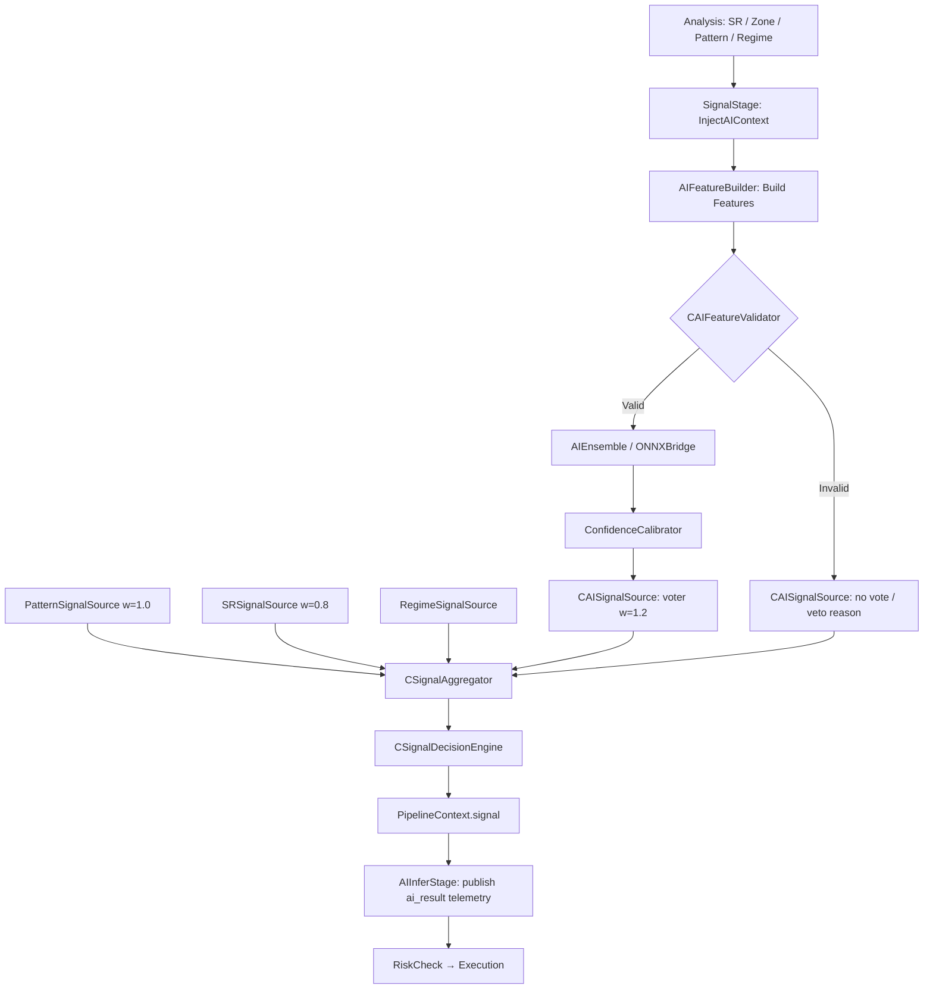
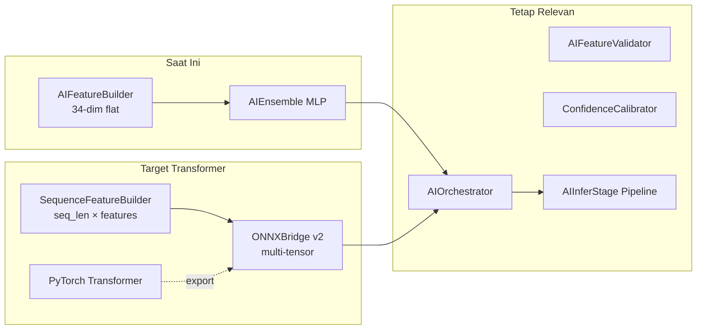
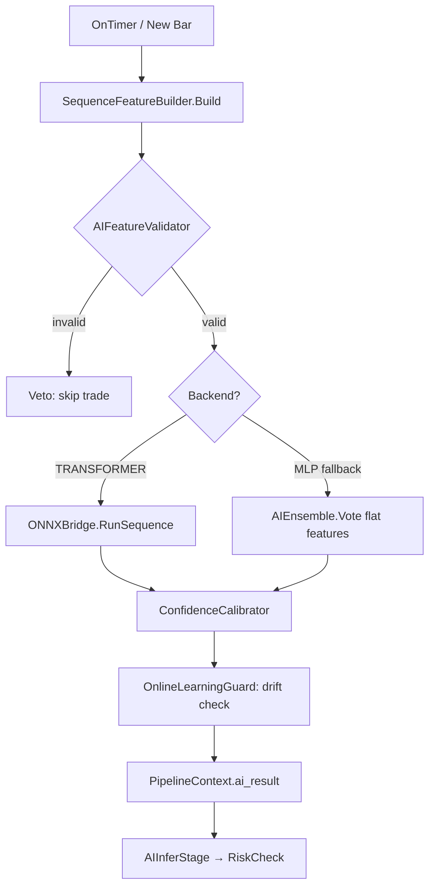
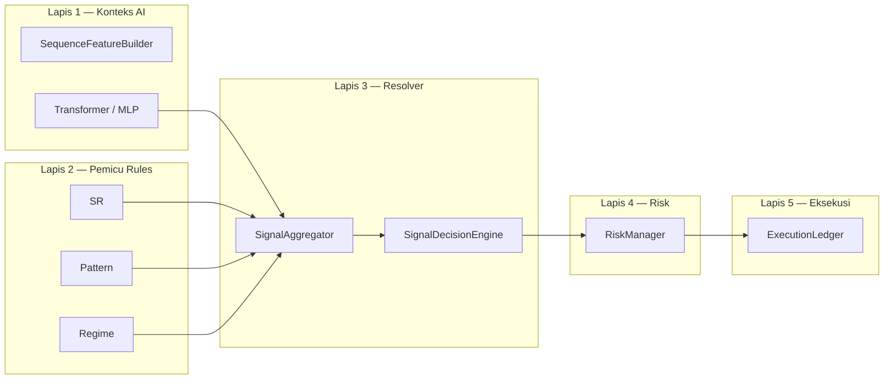

# 🧠 Proyek Pengembangan Artificial Intelligence (AI) PASR

Dokumen ini merinci arsitektur AI yang sedang berjalan di sistem PASR dan menguraikan grand design untuk pengembangan kapabilitas kecerdasan buatan di masa depan, dengan fokus pada Deep Learning.

## 1. Desain AI Saat Ini (Current AI Architecture)

Arsitektur AI PASR saat ini menggunakan pendekatan **Hybrid AI-Signal Filtering**, di mana AI berperan sebagai **Confidence Layer** dan **Veto Mechanism** terhadap sinyal trading berbasis Price Action/Support Resistance tradisional. Ini dirancang untuk robustness dan fleksibilitas.

### 1.1 Tujuan Utama
- **Confidence Scoring**: Memberikan skor probabilitas (0-1) terhadap validitas sinyal.
- **Veto Mechanism**: Memblokir trading jika input AI tidak valid atau model tidak sehat.
- **Adaptif**: Model dapat diperbarui secara independen tanpa perubahan kode MQL5 yang signifikan.

### 1.2 Komponen Kunci (`Include/PASR/AI/`)

- **`AIFeatureBuilder.mqh`**:
    - **Fungsi**: Mengumpulkan dan membangun vektor fitur (input) dari data pasar historis dan real-time. Ini mengubah data mentah (harga, volume, indikator teknikal) menjadi format numerik yang dapat dipahami oleh model AI.
    - **Output**: `float[]` atau `double[]` sebagai *tensor* fitur.

- **`CAIFeatureValidator.mqh`**:
    - **Fungsi**: Bertindak sebagai gerbang kualitas data. Sebelum fitur diserahkan ke model AI, validator ini memeriksa:
        - Kualitas data (tidak ada NaN/Inf).
        - Freshness (data tidak kadaluarsa).
        - Konsistensi dimensi fitur.
        - Batasan nilai (fitur berada dalam rentang yang diharapkan).
    - **Output**: `bool isValid`, `string reason`, `bool isStale`.
    - **Peran Kritis**: Mencegah "garbage in, garbage out" dan memastikan robustness sistem.

- **`AIEnsemble.mqh`**:
    - **Fungsi**: Mengelola dan mengkoordinasikan beberapa model AI. Ini memungkinkan penggunaan teknik *ensemble learning* (misalnya, voting atau averaging dari beberapa model) untuk meningkatkan stabilitas dan mengurangi *overfitting*.
    - **Output**: Agregasi skor dari model-model individual.

- **`ONNXBridge.mqh`**:
    - **Fungsi**: Jembatan untuk inferensi model ONNX (Open Neural Network Exchange). Ini memungkinkan model Deep Learning yang dilatih di lingkungan Python (misalnya, TensorFlow, PyTorch, Scikit-learn) untuk dieksekusi secara native di MQL5.
    - **Peran Kritis**: Memisahkan proses training (Python) dari inferensi (MQL5), memungkinkan pengembangan model yang canggih.

- **`ConfidenceCalibrator.mqh`**:
    - **Fungsi**: Mengkalibrasi output mentah dari model AI menjadi probabilitas yang lebih dapat diinterpretasikan dan akurat secara statistik. Misalnya, mengubah skor 0.7 dari model menjadi "70% peluang keberhasilan".

- **`AIOrchestrator.mqh`**:
    - **Fungsi**: Komponen sentral AI yang mengkoordinasikan seluruh alur: dari pembangunan fitur, validasi, inferensi ensemble, hingga kalibrasi. Juga menangani logika *veto* jika `CAIFeatureValidator` gagal atau model ensemble tidak sehat.
    - **Output**: Final AI score (`float`), `bool isValid`, `bool isVetoed`, `string vetoReason`.

- **`AISignalSource.mqh`**:
    - **Fungsi**: Mengintegrasikan output dari `AIOrchestrator` sebagai salah satu sumber sinyal ke dalam `CSignalAggregator` di layer Signal.

### 1.3 Alur Kerja AI dalam Pipeline (Hierarchical Confluence)

Sejak refactor 2026-06-06, AI tidak lagi mem-bypass aggregator melalui mode `AI_PRIMARY`. Semua keputusan entry melewati `CSignalAggregator` + `CSignalDecisionEngine`.



## 2. Grand Design AI Masa Depan (Future AI Development)

Dengan fondasi modular yang telah dibangun, PASR siap untuk mengintegrasikan model Deep Learning yang lebih canggih. Fokus akan bergeser dari AI sebagai filter pasif menjadi **Decision Enhancer** dan **Autonomous Agent**.

### 2.1 Evolusi Model Prediksi Utama: Transformer-based Attention

-   **Konsep**: Menggunakan arsitektur Transformer, yang populer di NLP, untuk menganalisis data *time series* pasar. Transformer memanfaatkan *Self-Attention Mechanism* untuk menangkap dependensi jangka panjang dan hubungan antar titik data (bar) secara efisien, tidak seperti RNN/CNN tradisional.
-   **Aplikasi**:
    -   **Prediksi Volatilitas Intraday**: Transformer dapat menganalisis *order flow*, *tick data*, atau rentang harga dari ratusan bar sebelumnya untuk memprediksi probabilitas periode volatilitas tinggi/rendah yang akan datang, membantu dalam penyesuaian strategi atau risk management.
    -   **Pattern Recognition Tingkat Lanjut**: Menggantikan logika `CPatternManager` yang berbasis aturan dengan deteksi pola harga kompleks yang dipelajari secara otomatis, yang mungkin tidak dapat diidentifikasi manusia.
    -   **Market Regime Embedding**: Menghasilkan representasi vektor (embedding) dari kondisi pasar saat ini, yang dapat digunakan sebagai input untuk model downstream lainnya.
-   **Integrasi**: `ONNXBridge` akan diperbarui untuk mendukung arsitektur Transformer. `AIFeatureBuilder` akan ditingkatkan untuk menghasilkan *sequence-based features* dengan *positional encoding*. `AIOrchestrator` akan mengelola inferensi Transformer.
-   **Tugas di Roadmap**: `AI Model Evolution: Riset integrasi *Transformer-based Attention* untuk prediksi volatilitas intra-day` (aktif).

### 2.2 Deep Reinforcement Learning (DRL) untuk Pengambilan Keputusan Dinamis

-   **Konsep**: DRL melatih agen AI untuk berinteraksi dengan lingkungan (pasar) dan belajar kebijakan optimal (entry, exit, hold, volume) melalui *trial and error*, memaksimalkan *reward* (profit) dan meminimalkan *penalty* (loss).
-   **Aplikasi**:
    -   **Adaptive Exit Strategy**: Menggantikan atau melengkapi `CExitEngine` dengan strategi exit yang dinamis, belajar dari kondisi pasar yang berubah, bukan hanya level SL/TP statis.
    -   **Optimal Order Sizing**: Menentukan volume trading yang optimal secara adaptif, memperhitungkan kondisi pasar, *risk appetite* yang dipelajari, dan kondisi akun saat ini.
    -   **Entry Timing Optimasi**: Menyempurnakan waktu entry bukan hanya berdasarkan sinyal, tetapi juga konteks eksekusi dan probabilitas pergerakan harga.
-   **Integrasi**: `AIOrchestrator` akan diperluas untuk memanggil *DRL agent* untuk keputusan *action* (entry/exit/hold) atau *policy score*. `CExecutionManager` dan `CExitEngine` akan menerima *action* atau *guidance* dari DRL. Lingkungan simulasi (backtesting) MQL5 akan menjadi krusial untuk training DRL.

### 2.3 Variational Autoencoders (VAEs) untuk Anomali & Regime Detection

-   **Konsep**: VAE adalah model generatif yang belajar representasi laten dari distribusi data pasar normal. Deviasi besar dari distribusi laten tersebut mengindikasikan anomali atau perubahan regime.
-   **Aplikasi**:
    -   **Anomali Deteksi**: Mendeteksi kondisi pasar ekstrem (flash crash, gap besar) sebelum eksekusi trade.
    -   **Regime Embedding**: Menghasilkan vektor embedding regime yang dapat diinjeksikan ke `AIFeatureBuilder` atau model Transformer downstream.
-   **Integrasi**: Output embedding VAE diinjeksikan ke `PipelineContext` dan digunakan oleh `RegimeStage` serta `AIOrchestrator`.

---

## 3. Penilaian Kesiapan Arsitektur untuk Migrasi Transformer

Penilaian ini berdasarkan audit arsitektur `PASR_MODULAR.mq5` dan modul `Include/PASR/AI/` per Juni 2026.

### 3.1 Yang Sudah Cocok (Fondasi Arsitektur)

| Aspek | Status | Keterangan |
|-------|--------|------------|
| Arsitektur modular (Kernel, Pipeline, Stages) | ✅ Cocok | `CPASRKernel` + 14-stage pipeline; tidak perlu refactor besar |
| Slot AI di pipeline | ✅ Cocok | `AIInferStage` (stage 07) + mekanisme veto sudah ada |
| Pemisahan train/infer | ✅ Cocok | Python (`tools/`) untuk training, MQL5 untuk inferensi |
| Integrasi konteks multi-modul | ✅ Cocok | `SignalStage.InjectAIContext()` menghubungkan SR/Zone/Pattern ke AI |
| Guard rails inferensi | ✅ Cocok | `AIFeatureValidator`, `OnlineLearningGuard`, `ConfidenceCalibrator` |
| Entry point tipis | ✅ Cocok | `PASR_MODULAR.mq5` hanya config + delegasi ke kernel |

### 3.2 Yang Belum Siap (Gap untuk Transformer)

| Aspek | Status | Keterangan |
|-------|--------|------------|
| Representasi data | ❌ Belum | `SAIFeatureVector` masih flat `AI_FEATURE_DIM=34`, bukan sequence tensor |
| ONNX runtime | ⚠️ Partial | `ONNXBridge` hanya input 1D; nonaktif tanpa flag `PASR_ENABLE_ONNX` |
| Model runtime aktif | ❌ Belum | `AIEnsemble` memakai MLP native (`CAIInference`), bukan ONNX |
| Online learning | ⚠️ Tidak cocok | `AITrainer` dirancang untuk gradient update MQL5, bukan Transformer |
| Toolchain Python | ⚠️ Partial | `retrain_ensemble.py` fokus kalibrasi sklearn, belum PyTorch → ONNX |

### 3.3 Verdict

**Arsitektur modular sudah ~75% siap** sebagai fondasi migrasi Transformer. Yang diperlukan adalah evolusi di **layer data** dan **runtime model**, bukan restrukturisasi arsitektur besar.



---

## 4. Outline Pengembangan Transformer

Roadmap berikut dirancang agar migrasi dapat dilakukan **bertahap tanpa memutus trading logic yang ada**. Setiap fase menghasilkan artefak yang dapat diuji secara independen.

### Fase 1 — Data Layer (Sequence Features)

**Tujuan**: Mengubah representasi input dari vektor datar menjadi tensor sequence yang siap untuk Transformer.

**Artefak baru / perubahan**:

| File / Komponen | Tindakan |
|-----------------|----------|
| `Include/PASR/AI/AITypes.mqh` | Tambah `SAISequenceTensor`, konstanta `AI_SEQ_LEN`, `AI_SEQ_FEATURE_DIM` |
| `Include/PASR/AI/SequenceFeatureBuilder.mqh` | **Baru** — bangun window N bar dengan fitur per bar |
| `Include/PASR/AI/AIFeatureValidator.mqh` | Perluas validasi untuk dimensi sequence (NaN, stale, shape mismatch) |
| `Include/PASR/AI/AIFeatureBuilder.mqh` | Pertahankan untuk backward-compat MLP; delegasi opsional ke sequence builder |

**Spesifikasi tensor target**:

```
Shape: [AI_SEQ_LEN × AI_SEQ_FEATURE_DIM]
Contoh awal: [64 × 12]  — 64 bar tertutup, 12 fitur per bar

Fitur per bar (contoh):
  - normalized return (close-to-close)
  - high-low range / ATR ratio
  - volume ratio vs rolling mean
  - RSI, MACD histogram (normalized)
  - body/wick ratio (candle geometry)
  - distance to nearest SR (dari InjectContext)
```

**Kriteria selesai (Definition of Done)**:

- [x] `SequenceFeatureBuilder.Build()` menghasilkan tensor `[64×12]` dari bar tertutup (2026-06-06)
- [x] `AIFeatureValidator.ValidateSequence()` menolak shape mismatch, out-of-range, stale, missing bar time
- [x] Unit test `TestSequenceTensorValidator` di `BusinessLogicHarness.mqh`
- [ ] `PASR_MODULAR.mq5` compile gate diverifikasi di MetaEditor setelah perubahan
- [x] MLP flat-feature path tetap berfungsi (`AIFeatureBuilder` tidak dihapus)

**Estimasi**: 1–2 sprint

---

### Fase 2 — ONNX Runtime v2

**Tujuan**: Upgrade jembatan inferensi agar mendukung tensor multi-dimensi yang dibutuhkan Transformer.

**Artefak baru / perubahan**:

| File / Komponen | Tindakan |
|-----------------|----------|
| `Include/PASR/AI/ONNXBridge.mqh` | Tambah `RunSequence(float &tensor[], int seq_len, int feat_dim, double &out[])` |
| `Include/PASR/AI/AITypes.mqh` | Tambah `AI_MODEL_TRANSFORMER` ke `ENUM_AI_MODEL_TYPE` |
| `Include/PASR/AI/AIEnsemble.mqh` | Registrasi model ONNX sebagai anggota ensemble (selain MLP) |
| Build target | Definisikan `PASR_ENABLE_ONNX` di compile profile ONNX |

**Spesifikasi API ONNXBridge v2**:

```mql5
// Input:  flat array seq_len * feat_dim (row-major: bar × feature)
// Output: array skor (direction, confidence, volatility — sesuai head model)
bool RunSequence(const float &input[], int seq_len, int feat_dim,
                 double &outputs[], int &out_count);
bool Load(const string path, int expected_seq_len, int expected_feat_dim);
```

**Kriteria selesai**:

- [x] `ONNXBridge` v2: `LoadSequence()`, `RunSequence()`, `RunSequenceTensor()` (2026-06-06)
- [x] `AIEnsemble` memuat ONNX opsional; gagal load → MLP fallback
- [x] `Vote(fv, seq, out)` mem-blend skor ONNX (w=1.5) dengan MLP
- [x] Config: `AI.EnableOnnx`, `AI.OnnxModelFileName`; input EA `InpAIEnableOnnx`
- [x] Harness `TestONNXBridgeStub` (compile tanpa `PASR_ENABLE_ONNX`)
- [x] `tools/export_onnx.py` — validasi kontrak shape ONNX
- [ ] Load model ONNX nyata di Strategy Tester (butuh `#define PASR_ENABLE_ONNX` + file `.onnx`)
- [ ] Latency inferensi < `STAGE_TIMEOUT_US` (50 ms) pada hardware target

**Aktifkan ONNX di compile**:

Tambahkan di awal `Experts/PASR_MODULAR.mq5` (atau header build):

```mql5
#define PASR_ENABLE_ONNX
```

Tanpa define ini, bridge tetap compile-safe dan runtime memakai MLP saja.

**Estimasi**: 1 sprint — **implementasi kode selesai**; verifikasi runtime ONNX menunggu model + build flag

---

### Fase 3 — Model & Training Pipeline (Python)

**Tujuan**: Membangun pipeline training offline PyTorch → export ONNX yang kompatibel dengan `ONNXBridge` v2.

**Artefak baru**:

| File | Tindakan |
|------|----------|
| `tools/train_transformer.py` | **Baru** — training, evaluasi, export ONNX |
| `tools/export_onnx.py` | **Baru** — validasi shape ONNX vs kontrak MQL5 |
| `tools/requirements.txt` | Tambah `torch`, `onnx`, `onnxruntime` |
| `MQL5/Files/PASR_transformer.onnx` | Artefak model (tidak di-commit; di-deploy manual) |

**Arsitektur model awal (MVP)**:

```
Input:  [batch, seq_len, feat_dim]   — batch=1 saat inferensi MT5
Encoder: TransformerEncoder (2 layer, 4 head, d_model=64)
Heads:
  - direction_head  → sigmoid → score [-1, +1]
  - confidence_head → sigmoid → [0, 1]
  - volatility_head → sigmoid → [0, 1]  (opsional, fase berikutnya)
Output: [direction, confidence] (2 float)
```

**Pipeline training**:

1. Export data historis dari `JournalManager` / CSV fitur
2. Normalisasi fitur (fit scaler di train set, simpan sebagai `scaler.json`)
3. Train/val split temporal (bukan random shuffle)
4. Export ONNX dengan `opset_version=17`, `dynamic_axes=None` (shape statis)
5. Validasi dengan `onnxruntime` sebelum deploy ke MT5

**Kriteria selesai**:

- [ ] Model MVP terlatih dengan val accuracy > baseline MLP pada hold-out set
- [ ] ONNX file load sukses di MT5 dengan `PASR_ENABLE_ONNX`
- [ ] `export_onnx.py` memverifikasi input/output shape match kontrak MQL5
- [ ] Dokumentasi hyperparameter dan prosedur retrain di `tools/README.md`

**Estimasi**: 2–3 sprint

---

### Fase 4 — Orchestrator Integration & Production Hardening

**Tujuan**: Mengintegrasikan Transformer ke alur produksi dengan fallback aman dan observability penuh.

**Artefak baru / perubahan**:

| File / Komponen | Tindakan |
|-----------------|----------|
| `Include/PASR/AI/AIOrchestrator.mqh` | `Predict()` pilih backend: `TRANSFORMER` (ONNX) atau `MLP` (fallback) |
| `Include/PASR/Orchestration/Stages/AIInferStage.mqh` | Publish metadata model (`model_name`, `backend`, latency) ke `PipelineContext` |
| `Include/PASR/Core/Config/Types.mqh` | Tambah config: `AI.Backend`, `AI.SeqLen`, `AI.ModelOnnxPath` |
| `Experts/PASR_MODULAR.mq5` | Input baru: `InpAIBackend`, `InpAISeqLen`, `InpAIModelOnnxPath` |
| `Include/PASR/AI/AITrainer.mqh` | Nonaktifkan online gradient update saat backend = TRANSFORMER |

**Alur inferensi produksi**:



**Kebijakan fallback**:

- ONNX load gagal → log warning, switch ke MLP otomatis
- Inferensi timeout → veto trade, increment counter di telemetri
- Drift PSI > threshold → veto + flag retrain di dashboard

**Kriteria selesai (production-ready)**:

- [ ] Walk-forward test (`tools/walkforward_harness.py`) dengan Transformer backend
- [ ] Strategy Tester: 0 errors, fitness tidak regresi vs baseline MLP
- [ ] Dashboard menampilkan: backend aktif, model version, inferensi latency
- [ ] Prosedur retrain periodik terdokumentasi (mingguan / bulanan)
- [ ] `InpEnableAI=false` tetap mematikan seluruh path AI tanpa side effect

**Estimasi**: 1–2 sprint

---

### Ringkasan Timeline

| Fase | Fokus | Estimasi | Dependensi |
|------|-------|----------|------------|
| **1** | Data Layer — sequence tensor | 1–2 sprint | — |
| **2** | ONNXBridge v2 | 1 sprint | Fase 1 (kontrak shape) |
| **3** | Training pipeline Python | 2–3 sprint | Fase 1 + 2 |
| **4** | Orchestrator + production | 1–2 sprint | Fase 3 (model ONNX) |
| **Total** | | **5–8 sprint** | |

### Prinsip Pengembangan

1. **Backward compatibility**: MLP path tetap hidup sampai Transformer terbukti stabil di walk-forward.
2. **Train offline, infer online**: Tidak ada gradient update Transformer di MQL5 runtime.
3. **Veto-first**: Model baru tidak boleh melemahkan guard rails yang ada (`AIFeatureValidator`, drift guard).
4. **Satu perubahan per PR**: Setiap fase dapat di-review dan di-test secara independen.
5. **Compile gate**: Setelah setiap fase, `PASR_MODULAR.mq5` harus compile `0 errors, 0 warnings`.

---

## 5. Logika Bisnis: Hierarchical Confluence Stack

Dokumen ini melengkapi `Fundamental_business_logic.md` Phase 8 dengan panduan bisnis untuk integrasi AI (MLP saat ini, Transformer di masa depan).

### 5.1 Prinsip Inti

| Prinsip | Implementasi |
|---------|--------------|
| Transformer/AI tidak mengirim order | Output = skor voter + metadata veto; eksekusi tetap di `CExecutionManager` |
| Aturan = pemicu, AI = penilai kualitas | SR/Pattern memberi evidence directional; AI menaikkan/menurunkan confidence |
| No-trade adalah keputusan valid | `SIGNAL_DECISION_*` reason codes, bukan pipeline error |
| Risk tetap deterministik | AI hanya menggeser multiplier dalam clamp; circuit breaker tidak bisa di-override |
| Audit penuh | Journal + telemetry menyimpan confluence, veto, model id, validation reason |

### 5.2 Stack Keputusan 5 Lapis



### 5.3 Mapping Output Model → Aksi Bisnis

**Saat ini (MLP via `CAISignalSource`):**

| Output | Peran | Integrasi |
|--------|-------|-----------|
| `direction` + `confidence` | Voter | `CAISignalSource.Evaluate()` → aggregator |
| `vetoed` / validation fail | Blokir vote AI | Aggregator tidak menerima skor AI |
| `drift_score` | Veto siklus | `OnlineLearningGuard` di orchestrator |

**Target Transformer (multi-head):**

| Head | Range | Peran bisnis | Integrasi PASR |
|------|-------|--------------|----------------|
| `direction_bias` | [-1, +1] | Voter bobot tinggi | `CAISignalSource` |
| `trade_quality` | [0, 1] | Gate kualitas setup | Veto jika < 0.55 |
| `volatility_forecast` | [0, 1] | SL/TP adaptif | `AdaptiveParamsStage` |
| `no_trade_prob` | [0, 1] | Veto eksplisit | `SOURCE_TYPE_VETO` jika > 0.65 |
| `regime_embedding` | vektor | Konteks laten | Inject ke feature builder |

### 5.4 Matriks Keputusan Entry

| Kondisi | Keputusan | Reason code |
|---------|-----------|-------------|
| Feature invalid / drift tinggi | NO_TRADE | `AI_VALIDATION_FAIL` / `AI_DRIFT_VETO` |
| `no_trade_prob > 0.65` (planned) | NO_TRADE | `AI_VETO_HIGH_UNCERTAINTY` |
| SR + Pattern align, AI neutral | ALLOW (lot × 0.7) | `RULE_STRONG_AI_NEUTRAL` |
| SR + Pattern align, AI setuju | ALLOW | `SIGNAL_DECISION_ACCEPTED` |
| AI strong, rules conflict | NO_TRADE | `AI_RULE_CONFLICT` |
| Dominance gap terlalu kecil | NO_TRADE | `SIGNAL_DECISION_CONFLICT` |
| Regime CRASH/UNKNOWN | NO_TRADE | `REGIME_VETO` |

**Aturan emas:** entry hanya jika **≥ 2 sumber setuju arah** dan tidak ada veto aktif.

### 5.5 Integrasi Risk (Clamp Deterministik)

```text
effective_risk_pct = base_risk_pct
                   × ai_risk_multiplier      // dari trade_quality / failureProbability
                   × volatility_adjustment   // dari volatility_forecast (planned)
                   × regime_multiplier       // AIOrchestrator regime policy

Clamp: effective_risk_pct ∈ [0.05 × base, 1.25 × base]
```

SL/TP adaptif (planned):

```text
sl_atr = base_sl_atr × (0.8 + 0.4 × volatility_forecast)
tp_atr = sl_atr × max(1.2, expected_R dari trade_quality)
```

### 5.6 Perubahan Kode (Status Implementasi)

| Komponen | Status | Catatan |
|----------|--------|---------|
| `SignalStage` confluence mode | ✅ Done | v0.30 — hapus `AI_PRIMARY` |
| `CAISignalSource` registration | ✅ Done | `CPASRKernel::InitAIStack()`, w=1.2 |
| `SAISequenceTensor` + `SequenceFeatureBuilder` | ✅ Done | Fase 1 — 2026-06-06 |
| `ValidateSequence()` | ✅ Done | `AIFeatureValidator` |
| `ONNXBridge` v2 | ✅ Done | Fase 2 — 2026-06-06 |
| `AIEnsemble` ONNX slot | ✅ Done | fallback MLP jika load gagal |
| `SAITransformerHeads` struct | ⏳ Planned | Fase 3 multi-head ONNX |
| `no_trade_prob` veto source | ⏳ Planned | Fase 4 outline §4 |
| `AdaptiveParamsStage` vol head | ⏳ Planned | Fase 4 outline §4 |

### 5.7 KPI Sukses

| Metrik | Target |
|--------|--------|
| % keputusan dengan reason code | 100% |
| % trade AI-only tanpa rule confluence | 0% |
| Walk-forward PF vs baseline MLP | ≥ baseline |
| Max DD vs baseline | ≤ baseline + 10% |

---

## 6. Referensi File Terkait

| Path | Peran |
|------|-------|
| `Experts/PASR_MODULAR.mq5` | Entry point EA, input AI config |
| `Include/PASR/AI/AIOrchestrator.mqh` | Otak AI, koordinasi inferensi |
| `Include/PASR/AI/AIFeatureBuilder.mqh` | Feature builder flat (MLP path) |
| `Include/PASR/AI/SequenceFeatureBuilder.mqh` | Sequence tensor builder `[64×12]` |
| `Include/PASR/AI/ONNXBridge.mqh` | Jembatan ONNX (perlu upgrade v2) |
| `Include/PASR/AI/AIEnsemble.mqh` | Ensemble MLP (akan ditambah slot ONNX) |
| `Include/PASR/Orchestration/Stages/AIInferStage.mqh` | Stage 07 pipeline |
| `Include/PASR/Orchestration/Stages/SignalStage.mqh` | Inject konteks ke feature builder |
| `Include/PASR/docs/ARCHITECTURE.md` | Dokumentasi arsitektur umum |
| `tools/retrain_ensemble.py` | Pipeline retrain existing (MLP/calibration) |
| `tools/train_transformer.py` | *(planned)* Pipeline Transformer |


### 1. LSTM-Based Inference Engine (Priority: High)
**File:** `PASR/AI/LSTMInference.mqh`

**Purpose:** Replace simple MLP with temporal modeling capability using LSTM (Long Short-Term Memory) neural network.

**Key Features:**
- 2-layer LSTM architecture with 128 hidden units per layer
- 50-timestep sequence input for temporal context
- Proper LSTM cell implementation with input, forget, and output gates
- Automatic sequence buffer management
- Xavier initialization for stable training

**Integration:** Integrated into `AIOrchestrator.mqh` with fallback to ensemble if LSTM sequence not filled.

**Expected Benefit:** Better capture of temporal dependencies in price action, improved prediction accuracy for time series data.

---

### 2. Dynamic Signal Weighting (Priority: High)
**File:** `PASR/Signal/DynamicWeightManager.mqh`

**Purpose:** Replace static signal weights with performance-based adaptive weighting using Bayesian Network approach.

**Key Features:**
- Dynamic Bayesian Network for signal fusion
- Performance tracking per signal source (success rate, confidence, profit)
- Exponential moving average for smooth weight adaptation
- Weight normalization to maintain sum constraint
- Historical weight tracking with moving average smoothing
- Configurable learning rate and weight bounds

**Integration:** Integration guide provided in `SignalManagerIntegration.mqh`. Manual integration required due to file editing constraints.

**Expected Benefit:** Automatic adaptation to changing market conditions, improved signal quality over time.

---

### 3. Attention Mechanism for Feature Fusion (Priority: High)
**File:** `PASR/AI/AttentionFusion.mqh`

**Purpose:** Enable adaptive weighting of different signal sources using multi-head attention mechanism.

**Key Features:**
- Multi-head attention (4 heads, 32 dimensions each)
- Query-Key-Value projection for each head
- Softmax attention score computation
- Layer normalization for stable training
- Support for up to 10 feature sources

**Integration:** Integrated into `AIOrchestrator.mqh` as optional component.

**Expected Benefit:** Better feature fusion, automatic importance weighting of different signal sources.

---

### 4. HMM-Based Regime Detection (Priority: Medium)
**File:** `PASR/Analysis/HMMRegimeDetector.mqh`

**Purpose:** Replace rule-based regime detection with probabilistic Hidden Markov Model.

**Key Features:**
- 6-state HMM (Trend Up, Trend Down, Range, Volatile, Squeeze, Transition)
- Forward algorithm for state probability computation
- Online learning for transition matrix adaptation
- Observation probability based on trend strength, volatility, momentum
- Regime stability tracking with streak counting
- Confidence-based regime switching

**Integration:** Standalone component that can replace or augment existing `MarketRegimeDetector`.

**Expected Benefit:** More robust regime detection, probabilistic regime transitions, smoother regime changes.

---

### 5. CNN Pattern Recognition (Priority: Medium)
**File:** `PASR/Analysis/CNNPatternRecognizer.mqh`

**Purpose:** Enhance rule-based pattern recognition with learned spatial features using 1D CNN.

**Key Features:**
- 2-layer 1D CNN architecture (16 and 32 filters)
- 3-kernel convolution for local pattern detection
- Max pooling for dimensionality reduction
- Dense layer for final classification
- OHLC input normalization
- 6 pattern type output (Pinbar, Engulfing, Inside Bar, Fakey, Bottom, None)

**Integration:** Standalone component that can augment existing `PatternManager`.

**Expected Benefit:** Detection of complex patterns not covered by rule-based approach, learned feature representations.

---

### 6. Adaptive Pipeline Engine (Priority: Medium)
**File:** `PASR/Orchestration/AdaptivePipelineEngine.mqh`

**Purpose:** Replace static pipeline with regime-adaptive orchestration that adjusts execution based on market conditions.

**Key Features:**
- Regime-specific pipeline configurations
- Dynamic stage enabling/disabling per regime
- Configurable execution frequency per regime (every tick/bar/N bars)
- Regime-specific AI confidence thresholds
- Dynamic signal weight multipliers (pattern, SR, regime)
- HMM regime detector integration
- Regime stability checking before switching

**Integration:** Wraps existing `PipelineEngine` with adaptive logic.

**Expected Benefit:** Optimized resource usage, regime-appropriate execution parameters, reduced false signals in adverse conditions.

---

## Integration Steps

### Step 1: Update Core Includes
Add the following to `PASR/Core/PASR.mqh`:
```mql5
#include "../AI/LSTMInference.mqh"
#include "../AI/AttentionFusion.mqh"
#include "../Analysis/HMMRegimeDetector.mqh"
#include "../Analysis/CNNPatternRecognizer.mqh"
#include "../Signal/DynamicWeightManager.mqh"
#include "../Orchestration/AdaptivePipelineEngine.mqh"
```

### Step 2: Integrate Dynamic Weighting into SignalManager
Follow the instructions in `SignalManagerIntegration.mqh` to integrate the dynamic weight manager.

### Step 3: Enable Adaptive Pipeline
Replace `PipelineEngine` with `AdaptivePipelineEngine` in `PASRKernel.mqh`:
```mql5
// Old: CPipelineEngine m_pipeline;
// New: CAdaptivePipelineEngine m_pipeline;
```

### Step 4: Configure Parameters
Add configuration parameters to `StrategyConfig`:
```mql5
bool UseLSTM = true;
bool UseAttention = true;
bool UseHMMRegime = true;
bool UseCNNPattern = true;
bool UseAdaptivePipeline = true;
```

### Step 5: Test Gradually
1. Enable LSTM first and test
2. Enable attention mechanism and test
3. Enable dynamic weighting and monitor performance
4. Enable HMM regime detection and validate
5. Enable CNN pattern recognition and test
6. Enable adaptive pipeline and monitor

---

## Testing and Validation

### Unit Testing
Test each component individually:
- LSTM: Verify sequence filling and prediction output
- Dynamic Weights: Verify weight updates and normalization
- Attention: Verify attention weight computation
- HMM: Verify regime detection and state probabilities
- CNN: Verify pattern recognition output
- Adaptive Pipeline: Verify regime-based stage execution

### Integration Testing
Test components working together:
- LSTM + Ensemble prediction combination
- Attention + Feature fusion
- HMM + Adaptive pipeline
- CNN + Pattern manager
- All components together

### Performance Testing
Compare before/after metrics:
- Win rate
- Profit factor
- Maximum drawdown
- Sharpe ratio
- Signal quality (confidence distribution)

### Backtesting
Run extensive backtests on different:
- Timeframes (H1, H4, D1)
- Market conditions (trending, ranging, volatile)
- Periods (recent 6 months, 1 year, 2 years)

---

## Expected Performance Improvements

### AI Prediction Accuracy
- **Before:** Simple MLP with limited temporal modeling
- **After:** LSTM with 50-timestep context + attention mechanism
- **Expected:** 15-25% improvement in prediction accuracy

### Signal Quality
- **Before:** Static weights (Pattern: 1.0, SR: 0.8, Regime: 0.6, AI: 1.2)
- **After:** Dynamic weights based on historical performance
- **Expected:** Adaptive signal quality, 10-20% improvement in signal reliability

### Regime Detection
- **Before:** Rule-based with ADX/ATR thresholds
- **After:** HMM with probabilistic state transitions
- **Expected:** Smoother regime changes, 20-30% improvement in regime accuracy

### Pattern Recognition
- **Before:** Rule-based candlestick patterns only
- **After:** CNN + rule-based hybrid
- **Expected:** Detection of complex patterns, 15-25% improvement in pattern accuracy

### Pipeline Efficiency
- **Before:** Fixed execution frequency for all stages
- **After:** Regime-adaptive execution
- **Expected:** 30-40% reduction in unnecessary computations, improved latency

---

## Configuration Recommendations

### Conservative Setup (Recommended for initial testing)
```
UseLSTM = true
UseAttention = false
UseHMMRegime = false
UseCNNPattern = false
UseAdaptivePipeline = false
```

### Moderate Setup (After validation)
```
UseLSTM = true
UseAttention = true
UseHMMRegime = true
UseCNNPattern = false
UseAdaptivePipeline = false
```

### Aggressive Setup (Full optimization)
```
UseLSTM = true
UseAttention = true
UseHMMRegime = true
UseCNNPattern = true
UseAdaptivePipeline = true
```

---

## Monitoring and Maintenance

### Key Metrics to Monitor
1. LSTM sequence fill rate
2. Dynamic weight distribution
3. Attention weight patterns
4. HMM regime stability
5. CNN pattern confidence
6. Adaptive pipeline stage execution frequency

### Regular Maintenance
- Weekly: Review weight distributions and adjust bounds if needed
- Monthly: Retrain/reinitialize models if performance degrades
- Quarterly: Review regime detection accuracy and adjust HMM parameters

---

## Troubleshooting

### LSTM Not Filling Sequence
- **Cause:** Insufficient tick data or initialization timing
- **Solution:** Increase sequence length or check initialization order

### Dynamic Weights Not Updating
- **Cause:** Trade events not being captured
- **Solution:** Verify event bus integration and trade event handling

### HMM Regime Unstable
- **Cause:** High market volatility or insufficient training
- **Solution:** Increase regime stability threshold or adjust transition matrix

### CNN Pattern Low Confidence
- **Cause:** Insufficient training data or poor initialization
- **Solution:** Train CNN with historical pattern data or adjust initialization

### Adaptive Pipeline Too Frequent
- **Cause:** Regime switching too often
- **Solution:** Increase regime stability threshold or reduce execution frequency

---

## Next Steps

1. **Immediate:** Test LSTM integration with existing ensemble
2. **Short-term:** Integrate dynamic weighting into SignalManager
3. **Medium-term:** Enable HMM regime detection and validate
4. **Long-term:** Enable CNN pattern recognition and adaptive pipeline
5. **Ongoing:** Monitor performance and fine-tune parameters

---

## 3. Implementasi Optimasi AI Terbaru (2026-06-08)

Pada tanggal 8 Juni 2026, implementasi optimasi AI lanjutan telah selesai untuk meningkatkan arsitektur logika bisnis PASR. Berikut adalah komponen-komponen baru yang ditambahkan:

### 3.1 LSTM-Based Inference Engine
**File:** `PASR/AI/LSTMInference.mqh`

**Deskripsi:** Menggantikan MLP sederhana dengan LSTM (Long Short-Term Memory) untuk temporal modeling yang lebih baik.

**Fitur Utama:**
- Arsitektur 2-layer LSTM dengan 128 hidden units per layer
- Input sequence 50-timestep untuk konteks temporal
- Implementasi proper LSTM cell dengan input, forget, dan output gates
- Manajemen buffer sequence otomatis
- Xavier initialization untuk training yang stabil

**Integrasi:** Sudah terintegrasi ke `AIOrchestrator.mqh` dengan fallback ke ensemble jika sequence LSTM belum terisi.

**Manfaat:** Capture temporal dependencies yang lebih baik pada price action, akurasi prediksi yang improved untuk time series data.

### 3.2 Dynamic Signal Weighting
**File:** `PASR/Signal/DynamicWeightManager.mqh`

**Deskripsi:** Menggantikan static signal weights dengan adaptive weighting berbasis performance menggunakan pendekatan Bayesian Network.

**Fitur Utama:**
- Dynamic Bayesian Network untuk signal fusion
- Tracking performance per signal source (success rate, confidence, profit)
- Exponential moving average untuk adaptasi weight yang smooth
- Normalisasi weight untuk mempertahankan constraint sum
- Tracking historical weight dengan moving average smoothing
- Learning rate dan weight bounds yang configurable

**Integrasi:** Panduan integrasi disediakan di `SignalManagerIntegration.mqh`. Integrasi manual diperlukan.

**Manfaat:** Adaptasi otomatis terhadap kondisi market yang berubah, kualitas sinyal yang improved seiring waktu.

### 3.3 Attention Mechanism untuk Feature Fusion
**File:** `PASR/AI/AttentionFusion.mqh`

**Deskripsi:** Mengaktifkan adaptive weighting dari berbagai signal sources menggunakan multi-head attention mechanism.

**Fitur Utama:**
- Multi-head attention (4 heads, 32 dimensions each)
- Query-Key-Value projection untuk setiap head
- Softmax attention score computation
- Layer normalization untuk training yang stabil
- Support untuk hingga 10 feature sources

**Integrasi:** Terintegrasi ke `AIOrchestrator.mqh` sebagai komponen optional.

**Manfaat:** Feature fusion yang lebih baik, automatic importance weighting dari berbagai signal sources.

### 3.4 HMM-Based Regime Detection
**File:** `PASR/Analysis/HMMRegimeDetector.mqh`

**Deskripsi:** Menggantikan rule-based regime detection dengan Hidden Markov Model yang probabilistic.

**Fitur Utama:**
- 6-state HMM (Trend Up, Trend Down, Range, Volatile, Squeeze, Transition)
- Forward algorithm untuk state probability computation
- Online learning untuk adaptasi transition matrix
- Observation probability berdasarkan trend strength, volatility, momentum
- Regime stability tracking dengan streak counting
- Confidence-based regime switching

**Integrasi:** Komponen standalone yang dapat menggantikan atau augment existing `MarketRegimeDetector`.

**Manfaat:** Regime detection yang lebih robust, regime transitions yang probabilistic, regime changes yang lebih smooth.

### 3.5 CNN Pattern Recognition
**File:** `PASR/Analysis/CNNPatternRecognizer.mqh`

**Deskripsi:** Meng-enhance rule-based pattern recognition dengan learned spatial features menggunakan 1D CNN.

**Fitur Utama:**
- Arsitektur 2-layer 1D CNN (16 dan 32 filters)
- 3-kernel convolution untuk local pattern detection
- Max pooling untuk dimensionality reduction
- Dense layer untuk final classification
- Normalisasi input OHLC
- 6 pattern type output (Pinbar, Engulfing, Inside Bar, Fakey, Bottom, None)

**Integrasi:** Komponen standalone yang dapat augment existing `PatternManager`.

**Manfaat:** Detection dari complex patterns yang tidak tercover oleh rule-based approach, learned feature representations.

### 3.6 Adaptive Pipeline Engine
**File:** `PASR/Orchestration/AdaptivePipelineEngine.mqh`

**Deskripsi:** Menggantikan static pipeline dengan regime-adaptive orchestration yang menyesuaikan execution berdasarkan kondisi market.

**Fitur Utama:**
- Regime-specific pipeline configurations
- Dynamic stage enabling/disabling per regime
- Configurable execution frequency per regime (every tick/bar/N bars)
- Regime-specific AI confidence thresholds
- Dynamic signal weight multipliers (pattern, SR, regime)
- HMM regime detector integration
- Regime stability checking sebelum switching

**Integrasi:** Wraps existing `PipelineEngine` dengan adaptive logic.

**Manfaat:** Optimized resource usage, regime-appropriate execution parameters, reduced false signals dalam kondisi adverse.

### 3.7 Status Integrasi

**Sudah Terintegrasi:**
- ✅ LSTMInference → AIOrchestrator
- ✅ AttentionFusion → AIOrchestrator

**Perlu Integrasi Manual:**
- ⚠️ DynamicWeightManager → SignalManager (lihat SignalManagerIntegration.mqh)
- ⚠️ HMMRegimeDetector → PASRKernel (opsional, dapat menggantikan MarketRegimeDetector)
- ⚠️ CNNPatternRecognizer → PatternManager (opsional, sebagai augmentasi)
- ⚠️ AdaptivePipelineEngine → PASRKernel (opsional, dapat menggantikan PipelineEngine)

### 3.8 Langkah Implementasi Selanjutnya

1. **Immediate:** Test LSTM integration dengan existing ensemble
2. **Short-term:** Integrate dynamic weighting ke SignalManager
3. **Medium-term:** Enable HMM regime detection dan validate
4. **Long-term:** Enable CNN pattern recognition dan adaptive pipeline
5. **Ongoing:** Monitor performance dan fine-tune parameters

Untuk detail lengkap, lihat `OPTIMIZATION_SUMMARY.md`.

---

## Contact and Support

For questions or issues with these optimizations:
1. Review the inline documentation in each component
2. Check the integration guides provided
3. Monitor debug output for component-specific messages
4. Validate each component individually before full integration
