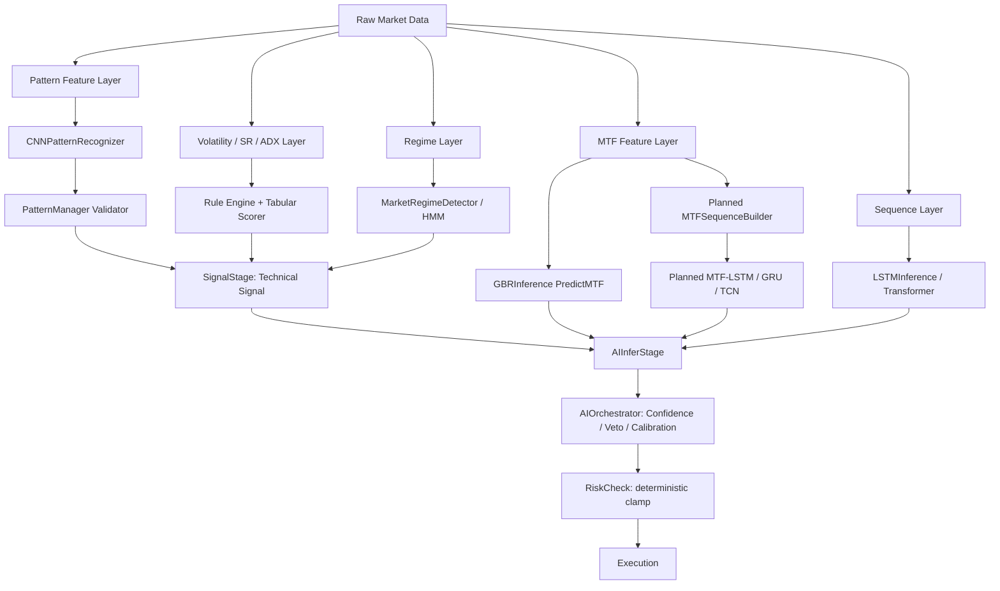
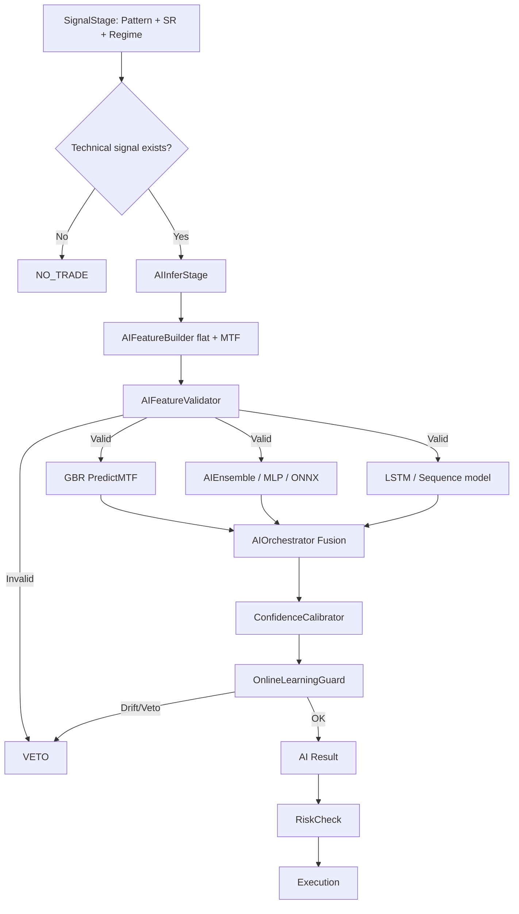

# 🧠 Proyek Pengembangan Artificial Intelligence (AI) PASR

Dokumen ini menjelaskan desain AI PASR berdasarkan **jenis data market** yang diproses oleh EA: candlestick pattern, multi-timeframe (MTF), volatility/ATR/ADX/SR, market regime, dan sequence/time-series.

Fokus desain terbaru bukan lagi memasukkan semua fitur ke satu model besar, melainkan membagi tugas model sesuai karakter datanya:

```text
Pattern candle      → CNN + rule validator
MTF snapshot        → GBR late fusion
MTF sequence        → LSTM/GRU/TCN atau Transformer kecil
Volatility/SR/ADX   → rule engine + tabular model
Market regime       → rule/HMM/classifier sebagai gate
Final decision      → AIOrchestrator sebagai confidence/gating layer
```

> Prinsip utama: **rules memberi sinyal teknikal awal, AI menilai kualitas dan risiko sinyal. AI tidak boleh menjadi satu-satunya alasan entry.**

---

## Status Update — 19 Juni 2026

### ✅ Sudah Tercapai / Tersedia di Kode

| Komponen | Modul | Status Integrasi | Catatan |
|----------|-------|------------------|---------|
| **AIFeatureBuilder** | `AI/` | ✅ Aktif | Flat feature builder; di branch MTF sudah dibuat timeframe-aware dan mendukung fused MTF feature |
| **GBRInference** | `AI/` | ✅ Aktif | ONNX/scalar tabular model + `PredictMTF()` untuk H4/H1/M15/M5 late fusion |
| **AIOrchestrator** | `AI/` | ✅ Aktif | Menggabungkan ensemble, LSTM, GBR, calibration, drift guard; di branch MTF diarahkan ke `PredictMTF()` |
| **AIEnsemble** | `AI/` | ✅ Aktif | MLP/native fallback + slot ONNX bila tersedia |
| **LSTMInference** | `AI/` | ✅ Kode ada | Sequence model 50 timestep; perlu validasi bobot training sebelum dipercaya sebagai model produksi |
| **SequenceFeatureBuilder** | `AI/` | ✅ Kode ada | Tensor sequence `[64×12]`, siap untuk Transformer/sequence backend |
| **ONNXBridge v2** | `AI/` | ✅ Kode ada | Mendukung flat/sequence tensor; runtime ONNX nyata tetap perlu diuji di Strategy Tester |
| **AIFeatureValidator** | `AI/` | ✅ Aktif | Validasi flat/sequence feature, NaN, stale, shape mismatch |
| **ConfidenceCalibrator** | `AI/` | ✅ Aktif | Kalibrasi confidence agar output model lebih stabil |
| **OnlineLearningGuard** | `AI/` | ✅ Aktif | Drift/veto guard; harus tetap berada sebelum eksekusi |
| **AttentionFusion** | `AI/` | ✅ Kode ada | Multi-head attention fusion; perlu evaluasi kontribusi aktual terhadap baseline |
| **CNNPatternRecognizer** | `Analysis/` | ✅ Kode ada | 1D CNN untuk candle geometry; digunakan sebagai augmentasi PatternManager, bukan entry langsung |
| **HMMRegimeDetector** | `Analysis/` | ✅ Kode ada | 6-state HMM regime; bisa menggantikan/melengkapi detector berbasis rule |
| **DynamicWeightManager** | `Signal/` | ⚠️ Kode siap | Perlu integrasi/performance tracking stabil sebelum produksi |
| **AdaptivePipelineEngine** | `Orchestration/` | ⚠️ Kode siap | Cocok untuk eksekusi berbeda per regime; integrasi bertahap |

### ⚠️ Catatan Arsitektur Setelah Audit MTF

| Area | Temuan | Keputusan Desain |
|------|--------|------------------|
| AI sebagai voter | AI sebelumnya berpotensi dipanggil di `SignalStage` dan `AIInferStage` | AI sebaiknya hanya menjadi **filter/gate** setelah sinyal teknikal terbentuk |
| GBR MTF | `PredictMTF()` sudah ada tetapi sebelumnya belum menjadi jalur utama | `AIOrchestrator` harus mencoba `PredictMTF()` terlebih dahulu, lalu fallback ke `Predict()` |
| Feature MTF | Feature builder sebelumnya cenderung single timeframe | Feature builder perlu menerima `ENUM_TIMEFRAMES` dan membangun H4/H1/M15/M5 |
| LSTM/RNN MTF | Konsep awal MTF memakai RNN | Saat ini MTF runtime utama adalah **GBR late fusion**; RNN/GRU/TCN MTF menjadi fase lanjutan |
| CNN Pattern | CNN cocok untuk pattern candle | CNN harus menghasilkan probabilitas/embedding pattern; validasi arah dan konteks tetap oleh `PatternManager` |

---

## 1. Filosofi Desain AI PASR

### 1.1 AI Bukan Pengganti PASR, AI Adalah Quality Layer

PASR tetap berbasis:

```text
Price Action + Support/Resistance + Market Regime + Risk Management
```

AI berperan sebagai:

```text
confidence scorer
quality filter
veto mechanism
risk/routing advisor
```

AI **tidak** boleh:

```text
mengirim order langsung
mengabaikan SR/Pattern/Regime
meng-override circuit breaker
meningkatkan risk tanpa clamp deterministik
```

### 1.2 Prinsip Data-Type Fit

Setiap tipe data market memiliki bentuk berbeda. Karena itu model yang dipakai juga harus berbeda.

| Jenis Data | Contoh | Bentuk Data | Model yang Cocok | Peran Bisnis |
|------------|--------|-------------|------------------|--------------|
| **Pattern candle** | pinbar, engulfing, fakey, inside bar | local spatial/shape | CNN + rule validator | mengenali bentuk candle dan kualitas rejection |
| **MTF snapshot** | H4/H1/M15/M5 saat ini | hierarchical tabular | GBR late fusion | alignment score dan bias arah antar-timeframe |
| **MTF sequence** | urutan H4/H1/M15/M5 | temporal sequence | LSTM/GRU/TCN/Transformer | momentum, transition, follow-through |
| **Volatility** | ATR, range, spread, volume spike | numeric state | rule + GBR/classifier | risk adjustment, SL/TP mode, no-trade filter |
| **Trend strength** | ADX, slope, MA distance | numeric state | rule + tabular model | trend-following vs mean-reversion gate |
| **SR/Zone** | distance to SR, zone strength | structural numeric | rule + tabular model | validasi lokasi entry/invalidation |
| **Market regime** | ranging, trending, squeeze, volatile | discrete/probabilistic state | rule/HMM/classifier | memilih mode strategi dan threshold |
| **Final decision** | semua skor digabung | fused metadata | AIOrchestrator/meta-gate | BUY/SELL/NO_TRADE + risk multiplier |

---

## 2. Arsitektur Target Berdasarkan Jenis Data



### 2.1 Pembagian Tanggung Jawab

| Layer | Tanggung Jawab | Tidak Boleh Melakukan |
|-------|----------------|-----------------------|
| Pattern Layer | mengenali bentuk candle dan rejection | membuka trade sendirian |
| MTF Layer | memberi bias/alignment HTF-LTF | mengganti risk rule |
| Volatility Layer | menentukan aman/tidaknya kondisi eksekusi | menjadi directional signal utama |
| Regime Layer | memilih mode strategi dan threshold | memaksa entry tanpa pattern/SR |
| Sequence Layer | membaca momentum dan transition | menjadi satu-satunya model entry |
| AIOrchestrator | menggabungkan skor, kalibrasi, veto | mengabaikan validator/drift guard |
| Risk Layer | lot, SL/TP, clamp, kill switch | menerima risk multiplier tanpa batas |

---

## 3. Pattern Architecture — CNN + PatternManager

### 3.1 Mengapa Pattern Cocok Memakai CNN

Pattern candlestick adalah data berbentuk lokal/spasial:

```text
body size
upper/lower wick
relative close position
engulfing range
inside bar compression
fakey/trap structure
rejection candle geometry
```

Karena itu CNN cocok untuk mengenali pola bentuk pada window candle.

### 3.2 Peran `CNNPatternRecognizer`

Target input:

```text
window candle: 20 bar
fitur dasar: OHLC normalized
shape: [20 × 4]
```

Target output ideal:

```text
pattern_type
pattern_direction
pattern_confidence
rejection_quality
trap_probability
follow_through_probability
```

### 3.3 Peran `PatternManager`

`PatternManager` tetap menjadi validator bisnis:

```text
apakah pattern dekat SR/zone?
apakah rejection valid?
apakah pattern searah HTF bias?
apakah pattern sesuai regime?
apakah pattern muncul setelah liquidity sweep/trap?
```

### 3.4 Keputusan Desain

```text
CNN = recognizer bentuk
PatternManager = validator konteks
SignalStage = pembentuk sinyal teknikal
AIInferStage = quality gate setelah sinyal teknikal ada
```

CNN tidak boleh menjadi `BUY/SELL` engine tunggal. Output CNN harus masuk sebagai **evidence** untuk PatternManager atau feature AI.

---

## 4. Multi-Timeframe Architecture — GBR MTF + Planned RNN/GRU

### 4.1 Dua Jenis Data MTF

MTF sebenarnya memiliki dua bentuk data:

| Bentuk MTF | Contoh | Model Cocok |
|------------|--------|-------------|
| **Snapshot MTF** | kondisi H4/H1/M15/M5 pada bar sekarang | GBR late fusion |
| **Sequence MTF** | perubahan H4/H1/M15/M5 selama N bar | LSTM/GRU/TCN/Transformer |

Karena itu, MTF tidak ideal jika hanya dipaksa ke RNN. Pendekatan terbaik adalah hybrid:

```text
GBR MTF      → membaca alignment kondisi sekarang
MTF Sequence → membaca perubahan waktu dan transition
```

### 4.2 Runtime MTF Saat Ini

Jalur runtime yang diutamakan:

```text
AIFeatureBuilder.Build(tf=H4)
AIFeatureBuilder.Build(tf=H1)
AIFeatureBuilder.Build(tf=M15)
AIFeatureBuilder.Build(tf=M5)
        ↓
GBRInference.PredictMTF(fv_array, mtf_result)
        ↓
gbr_score + gbr_confidence
```

Bobot awal:

```text
H4  = 0.35  → bias utama / macro structure
H1  = 0.30  → validasi trend/structure
M15 = 0.25  → timing setup
M5  = 0.10  → trigger precision
```

### 4.3 Fallback

Jika `PredictMTF()` gagal karena data timeframe tidak lengkap atau model belum siap:

```text
fallback → GBRInference.Predict(fv_current)
```

EA harus tetap aman berjalan, tetapi telemetry harus menunjukkan apakah model memakai:

```text
gbr_mtf
gbr_single
ensemble_only
```

### 4.4 Fase Lanjutan: MTF-RNN/GRU/TCN

Jika ingin mengikuti konsep awal “MTF memakai RNN”, bentuk yang lebih tepat adalah membuat model khusus:

```text
CMTFSequenceBuilder
    input: H4/H1/M15/M5 × N bar × feature_dim
    output: tensor MTF sequence

CMTFSequenceInference
    backend: GRU / LSTM / TCN / Transformer kecil
    output: mtf_temporal_bias + transition_probability
```

Target output:

```text
mtf_temporal_bias        [-1, +1]
mtf_alignment_confidence [0, 1]
transition_probability   [0, 1]
follow_through_score     [0, 1]
```

---

## 5. Volatility, ATR, ADX, SR, dan Zone Architecture

### 5.1 Karakter Data

ATR, ADX, SR distance, zone strength, volume ratio, spread, dan candle range adalah **tabular numeric state**. Mereka lebih cocok untuk rule engine dan model tabular, bukan CNN.

Contoh fitur:

```text
ATR ratio
ATR percentile
ADX value
ADX slope
range / ATR
spread / ATR
volume ratio
nearest SR distance
zone strength
wick rejection near zone
breakout distance
```

### 5.2 Peran Bisnis

Volatility/SR/ADX tidak sebaiknya menjadi sinyal entry mandiri. Mereka adalah:

```text
filter kualitas
risk multiplier
SL/TP adapter
no-trade detector
strategy mode selector
```

Contoh keputusan:

| Kondisi | Keputusan |
|---------|-----------|
| ATR terlalu rendah | hindari breakout lemah; tunggu expansion |
| ATR ekstrem | kurangi lot atau veto entry |
| ADX tinggi | prioritaskan continuation/trend-following |
| ADX rendah | prioritaskan range/SR reversal |
| dekat SR kuat | reversal pattern lebih bernilai |
| jauh dari SR | reversal pattern harus diberi confidence lebih rendah |
| spread/ATR buruk | no-trade / delay entry |

### 5.3 Model yang Cocok

```text
Rule engine      → hard safety filter
GBR/XGBoost      → tabular quality score
Logistic model   → baseline sederhana
Classifier       → low/normal/high/extreme volatility state
```

Output ideal:

```text
volatility_state: LOW / NORMAL / HIGH / EXTREME
trend_strength: WEAK / MODERATE / STRONG
structure_quality: POOR / ACCEPTABLE / STRONG
risk_multiplier: 0.0–1.25
min_confidence_required: dynamic threshold
```

---

## 6. Market Regime Architecture

### 6.1 Regime Adalah State, Bukan Entry Signal

Regime menjawab:

```text
market sekarang cocok untuk strategi apa?
trend-following?
mean-reversion?
breakout?
no-trade?
```

Contoh state:

```text
TREND_UP
TREND_DOWN
RANGE
VOLATILE
SQUEEZE
TRANSITION
CRASH / UNKNOWN
```

### 6.2 Model yang Cocok

| Model | Kelebihan | Penggunaan |
|-------|-----------|------------|
| Rule-based detector | stabil, mudah debug | baseline produksi |
| HMM | probabilistic transition | smoothing regime dan transition |
| GBR/classifier | tabular regime probability | confidence tambahan |
| LSTM/GRU | sequence transition | mendeteksi perubahan regime |
| VAE | anomaly/regime embedding | fase lanjutan |

### 6.3 Regime Gate

Contoh policy:

```text
REGIME_TREND_UP:
  allow buy continuation
  reject weak sell reversal
  trailing lebih longgar

REGIME_TREND_DOWN:
  allow sell continuation
  reject weak buy reversal

REGIME_RANGE:
  allow SR reversal
  reject weak breakout

REGIME_VOLATILE:
  reduce lot
  widen SL by ATR rule
  require higher confidence

REGIME_SQUEEZE:
  wait for breakout confirmation

REGIME_TRANSITION:
  reduce aggressiveness
  require MTF + pattern confirmation

REGIME_CRASH / UNKNOWN:
  no-trade by default
```

---

## 7. Sequence Architecture — LSTM/GRU/TCN/Transformer

### 7.1 Kapan Sequence Model Dibutuhkan

Sequence model cocok jika pertanyaannya berbasis perubahan waktu:

```text
apakah momentum menguat atau melemah?
apakah breakout punya follow-through?
apakah reversal mulai valid?
apakah volatility expansion baru dimulai?
apakah regime sedang transition?
```

### 7.2 LSTMInference Saat Ini

`LSTMInference` sudah tersedia sebagai sequence model dengan window temporal. Namun untuk produksi, perlu validasi tambahan:

```text
apakah bobot berasal dari training nyata?
apakah ada pipeline export/import weight?
apakah walk-forward mengalahkan baseline MLP/GBR?
apakah output stabil di simbol/timeframe berbeda?
```

Sebelum validasi itu selesai, LSTM sebaiknya diberi bobot kecil atau menjadi optional filter.

### 7.3 Rekomendasi Sequence Model

| Model | Cocok Untuk | Catatan |
|-------|-------------|---------|
| LSTM | long temporal memory | lebih berat, perlu training kuat |
| GRU | sequence lebih ringan | kandidat terbaik untuk MQL5 runtime |
| TCN | sequence dengan convolution temporal | stabil, ringan, cocok ONNX |
| Transformer kecil | long-range dependency | butuh dataset besar dan ONNX runtime stabil |

---

## 8. AIOrchestrator — Fusion dan Gating

### 8.1 Pipeline Produksi yang Disarankan



### 8.2 Hard Gate Lebih Penting dari Weighted Average

Jangan hanya memakai rata-rata skor model. Gunakan gate terlebih dahulu:

```text
1. Feature invalid        → NO_TRADE
2. Regime crash/unknown   → NO_TRADE
3. Volatility extreme     → NO_TRADE / reduce risk
4. MTF conflict besar     → NO_TRADE
5. Pattern lemah          → NO_TRADE
6. Jika lolos semua       → confidence fusion menentukan entry/risk
```

### 8.3 Contoh Fusion Awal

```text
technical_signal_score = 0.40
mtf_gbr_score          = 0.20
pattern_cnn_score      = 0.15
regime_score           = 0.15
sequence_score         = 0.10
```

Setelah model sequence dan CNN tervalidasi:

```text
technical_signal_score = 0.30
mtf_gbr_score          = 0.25
pattern_cnn_score      = 0.15
regime_score           = 0.15
sequence_score         = 0.15
```

Namun semua skor tetap tunduk pada veto:

```text
final_entry = technical_signal_exists
           && no_hard_veto
           && mtf_alignment_ok
           && regime_allows_strategy
           && calibrated_confidence >= dynamic_threshold
```

---

## 9. Roadmap Pengembangan Bertahap

### Fase 0 — Runtime MTF & AI Gating Cleanup

**Tujuan:** memperbaiki logika MTF saat ini tanpa rewrite besar.

| Item | Status | Catatan |
|------|--------|---------|
| `AIFeatureBuilder` timeframe-aware | ✅ Branch MTF | `Build(out, tf)` / `SetTimeframe(tf)` |
| `GBRInference.PredictMTF()` dipakai runtime | ✅ Branch MTF | `AIOrchestrator` mencoba MTF lebih dulu |
| AI tidak double-predict sebagai signal source | ✅ Branch MTF | AI sebagai gate/filter di `AIInferStage` |
| Fallback single-TF aman | ✅ Branch MTF | jika MTF gagal, gunakan `Predict(fv)` |
| MetaEditor compile gate | ⏳ Manual | wajib 0 errors sebelum merge |

### Fase 1 — Stabilkan CNN Pattern Recognition

| Item | Target |
|------|--------|
| Pastikan candle buffer CNN benar-benar filled | CNN tidak silent-inactive |
| Output layer multi-class valid | probabilitas pattern tidak identik |
| Tambah direction-aware output | bullish/bearish/neutral |
| Integrasi ke PatternManager | CNN sebagai augmentasi, bukan entry source |
| Dataset label pattern | untuk training/evaluasi CNN |

### Fase 2 — Validasi GBR MTF

| Item | Target |
|------|--------|
| Dataset H4/H1/M15/M5 aligned | tidak ada leakage antar-timeframe |
| Train GBR/XGBoost/LightGBM offline | export ONNX/scalar compatible |
| Walk-forward test | bandingkan vs single-TF baseline |
| Telemetry model id | `gbr_mtf` vs `gbr_single` |
| Latency check | aman untuk Strategy Tester/live |

### Fase 3 — MTF Sequence Model

| Item | Target |
|------|--------|
| `CMTFSequenceBuilder` | tensor `[tf × seq_len × feature_dim]` |
| Backend GRU/TCN/LSTM | pilih yang paling ringan dan stabil |
| Output temporal MTF | `transition_probability`, `follow_through_score` |
| Fusion dengan GBR MTF | snapshot + temporal context |

### Fase 4 — Transformer Multi-Head

Transformer tetap menjadi target lanjutan, tetapi bukan pengganti semua modul.

Target multi-head:

```text
direction_bias       [-1, +1]
trade_quality        [0, 1]
volatility_forecast  [0, 1]
no_trade_probability [0, 1]
regime_embedding     vector
```

Kontrak runtime:

```text
train offline di Python
export ke ONNX
infer online di MQL5
fallback ke MLP/GBR jika ONNX gagal
```

### Fase 5 — DRL / Agentic Decision Layer

DRL hanya boleh dipertimbangkan setelah:

```text
feature pipeline stabil
risk engine deterministik
walk-forward baseline jelas
slippage/spread/cost realistis
telemetry lengkap
```

DRL lebih cocok untuk:

```text
exit policy
position sizing suggestion
time-in-trade management
```

Bukan untuk membuka entry tanpa confluence PASR.

---

## 10. Kontrak Training dan Runtime

### 10.1 Train Offline, Infer Online

MQL5 runtime sebaiknya hanya melakukan inferensi dan guardrail:

```text
Training     → Python / PyTorch / sklearn / XGBoost
Export       → ONNX / weights / scaler
Deployment   → MQL5/Files
Inference    → MQL5 ONNXBridge / native fallback
Validation   → AIFeatureValidator + OnlineLearningGuard
```

### 10.2 Hindari Data Leakage

Untuk MTF/sequence:

```text
gunakan hanya closed bar
sinkronisasi timestamp antar-timeframe
jangan memakai candle HTF yang belum close
train/validation split harus temporal, bukan random
normalisasi scaler fit hanya dari train set
```

### 10.3 Labeling Awal

Label yang disarankan:

```text
future_return_R
max_favorable_excursion_R
max_adverse_excursion_R
hit_tp_before_sl
no_trade_label
regime_transition_label
```

Output model tidak harus langsung `BUY/SELL`; lebih baik prediksi kualitas dan risiko setup.

---

## 11. Testing dan Validasi

### 11.1 Compile Gate

Setiap fase harus lolos:

```text
MetaEditor compile: 0 errors
warning maksimal harus didokumentasikan
InpEnableAI=false tidak boleh mengubah jalur trading non-AI
```

### 11.2 Unit/Component Test

| Komponen | Test |
|----------|------|
| `AIFeatureBuilder` | build H4/H1/M15/M5, no NaN, timestamp valid |
| `GBRInference` | `PredictMTF()` valid dan fallback aman |
| `CNNPatternRecognizer` | output class probability valid |
| `LSTMInference` | sequence buffer fill rate, output finite |
| `HMMRegimeDetector` | transition stability, confidence threshold |
| `AIFeatureValidator` | reject stale/missing/outlier |
| `AIOrchestrator` | no double-predict, telemetry model id benar |

### 11.3 Backtest Matrix

Minimal:

```text
Symbol: major pairs + gold jika target
Timeframe chart: M5, M15, H1
Regime: trending, ranging, volatile, squeeze
Period: 6 bulan, 1 tahun, 2 tahun
Mode: AI off, GBR single, GBR MTF, full AI
```

### 11.4 KPI Sukses

| Metrik | Target |
|--------|--------|
| Trade AI-only tanpa rule confluence | 0% |
| Decision dengan reason code | 100% |
| Winrate/PF vs baseline non-AI | ≥ baseline setelah cost |
| Max drawdown | ≤ baseline + toleransi yang disepakati |
| MTF conflict avoided | meningkat tanpa terlalu banyak false veto |
| Latency AIInferStage | di bawah timeout pipeline |

---

## 12. Konfigurasi Rekomendasi

### Conservative — untuk validasi awal

```text
UseAI = true
UseMTF = true
UseGBR = true
UseLSTM = false atau low weight
UseCNNPattern = false
UseHMMRegime = false
UseTransformer = false
```

Tujuan: validasi `GBR PredictMTF` dan no-double-predict.

### Moderate — setelah MTF stabil

```text
UseAI = true
UseMTF = true
UseGBR = true
UseLSTM = true sebagai sequence filter kecil
UseCNNPattern = true sebagai pattern augmentation
UseHMMRegime = true sebagai regime gate
UseTransformer = false
```

### Aggressive — setelah training pipeline valid

```text
UseAI = true
UseMTF = true
UseGBR = true
UseMTFSequence = true
UseCNNPattern = true
UseHMMRegime = true
UseTransformer = true dengan ONNX fallback
```

---

## 13. Troubleshooting

### MTF Tidak Aktif

Kemungkinan:

```text
InpUseMTF=false
GBR disabled
feature H4/H1/M15/M5 gagal dibangun
model ONNX tidak load
fallback ke single Predict
```

Yang dicek:

```text
model_id mengandung gbr_mtf?
log AIOrchestrator menampilkan GBR MTF prediction?
jumlah bar setiap timeframe cukup?
```

### LSTM Tidak Mengisi Sequence

Kemungkinan:

```text
bar belum cukup
sequence length terlalu panjang
fitur invalid/stale
model belum punya bobot training valid
```

### CNN Pattern Low Confidence

Kemungkinan:

```text
buffer candle belum filled
output layer multi-class belum valid
training data kurang
pattern label tidak direction-aware
```

### Regime Sering Berubah

Kemungkinan:

```text
threshold terlalu sensitif
transition smoothing kurang
ATR/ADX spike
market memang transisi
```

Solusi:

```text
naikkan stability threshold
pakai HMM transition smoothing
kurangi agresivitas saat TRANSITION
```

---

## 14. Referensi File Terkait

| Path | Peran |
|------|-------|
| `Experts/PASR_PRERELEASE.mq5` | Entry EA prerelease dan input runtime |
| `Experts/PASR_MODULAR.mq5` | Entry point modular jika digunakan |
| `Include/PASR/AI/AIOrchestrator.mqh` | Otak AI: fusion, GBR/LSTM/ensemble, calibration, veto |
| `Include/PASR/AI/AIFeatureBuilder.mqh` | Flat feature builder + MTF feature builder |
| `Include/PASR/AI/GBRInference.mqh` | GBR ONNX/scalar + `PredictMTF()` |
| `Include/PASR/AI/LSTMInference.mqh` | Sequence/RNN-family inference |
| `Include/PASR/AI/SequenceFeatureBuilder.mqh` | Tensor sequence `[seq_len × feature_dim]` |
| `Include/PASR/AI/ONNXBridge.mqh` | Runtime ONNX bridge |
| `Include/PASR/AI/AIFeatureValidator.mqh` | Validasi feature flat/sequence |
| `Include/PASR/Analysis/CNNPatternRecognizer.mqh` | CNN pattern recognition |
| `Include/PASR/Analysis/PatternManager.mqh` | Pattern rule/context validator |
| `Include/PASR/Analysis/HMMRegimeDetector.mqh` | Probabilistic regime detector |
| `Include/PASR/Orchestration/Stages/SignalStage.mqh` | Pembentukan sinyal teknikal |
| `Include/PASR/Orchestration/Stages/AIInferStage.mqh` | AI confidence/gating stage |
| `Include/PASR/Signal/DynamicWeightManager.mqh` | Adaptive signal weight tracking |
| `tools/export_onnx.py` | Validasi/export ONNX |
| `tools/train_transformer.py` | Planned training Transformer |

---

## 15. Ringkasan Keputusan Desain

```text
Pattern       → CNN + PatternManager
MTF snapshot  → GBR PredictMTF
MTF sequence  → planned GRU/LSTM/TCN/Transformer
ATR/ADX/SR    → rule engine + tabular scorer
Regime        → rule/HMM/classifier as strategy gate
Sequence      → LSTM/GRU/TCN for momentum/transition
Final entry   → AIOrchestrator gating + deterministic RiskManager
```

Keputusan paling penting:

```text
AI bukan entry generator utama.
AI adalah quality, veto, calibration, dan risk guidance layer.
Pattern, MTF, volatility, SR, dan regime harus diproses sesuai jenis datanya masing-masing.
```
