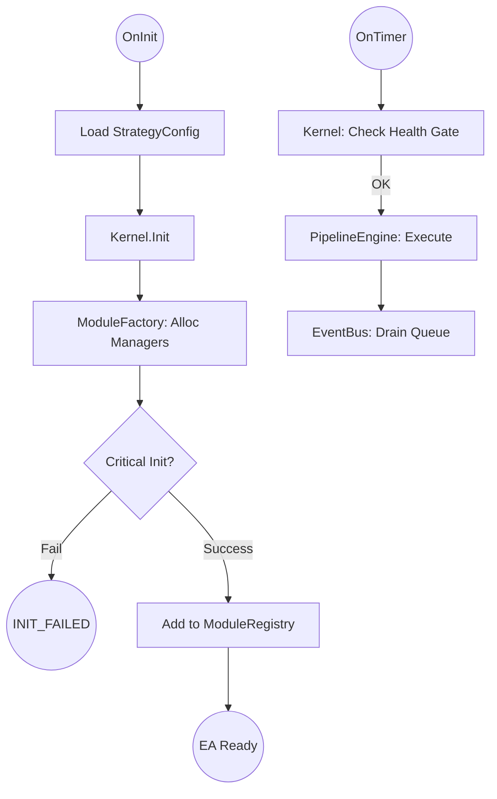
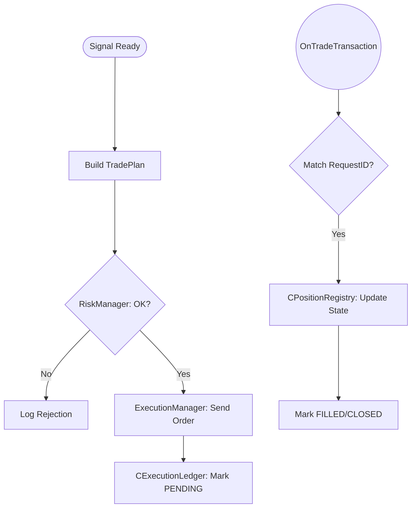
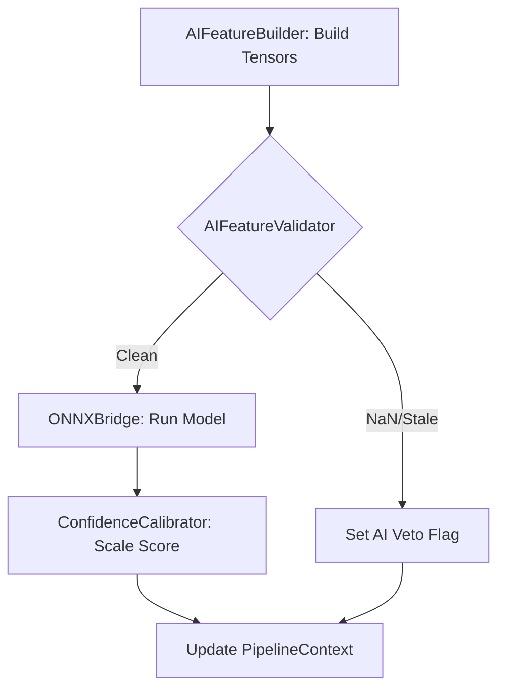
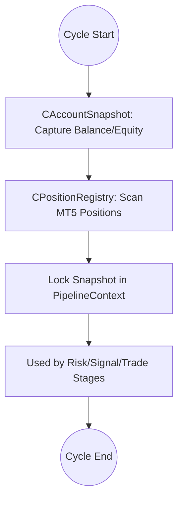

# Component Interaction Map

Dokumen ini menjelaskan bagaimana komponen utama dalam PASR berkomunikasi satu sama lain menggunakan pola *Decoupled Architecture*.

## 1. Komunikasi via EventBus (Asinkron)
Banyak manager berkomunikasi tanpa saling mengenal melalui `CEventBus`.

- **Publisher**: `DataManager` mendeteksi bar baru -> Mengirim `EVENT_NEW_BAR`.
- **Subscribers**:
    - `SRManager`: Menghitung ulang level SR.
    - `StateManager`: Menyimpan state saat ini ke disk.
    - `JournalManager`: Mencatat statistik bar sebelumnya.

## 2. Resolusi Dependency via ServiceLocator (Sinkron)
Ketika sebuah komponen membutuhkan layanan dari komponen lain selama eksekusi pipeline:

```cpp
// Contoh di dalam RiskStage
CRiskManager* risk = serviceLocator.GetManager(PN_RISK_MANAGER);
IDataManager* data = serviceLocator.GetManager(PN_DATA_MANAGER);

if(risk.Check(data.GetAccountSnapshot())) { ... }
```

## 3. Alur Data Trading (The Ledger System)
Untuk memastikan keamanan transaksi, PASR menggunakan sistem buku kas (ledger):

1. **SignalStage** menghasilkan `TradePlan`.
2. **RiskStage** memvalidasi `TradePlan` terhadap snapshot akun.
3. **ExecutionStage** mengirim permintaan ke broker dan mencatat `requestId` di `CExecutionLedger`.
4. **OnTradeTransaction** (Kernel) menerima konfirmasi dari broker.
5. **PositionRegistry** diperbarui berdasarkan transaksi yang dikonfirmasi.
6. **RecoveryStage** melihat posisi baru di registry dan mulai melakukan tracking.

## 4. AI & Feature Guard Interaction
Interaksi AI diatur secara ketat untuk mencegah data sampah:

1. **AIFeatureBuilder** mengumpulkan data teknikal.
2. **AIFeatureValidator** memeriksa apakah data mengandung NaN, out-of-range, atau stale (kadaluarsa).
3. Jika valid, **AIOrchestrator** memanggil model ONNX.
4. Hasil skoring (0.0 - 1.0) dikirim kembali ke `PipelineContext`.
5. Jika validator gagal, AI memberikan flag `veto`, dan sistem otomatis beralih ke logika *rule-based* murni.

---

# 🗺️ PASR Component Flow Charts

Dokumen ini menyediakan visualisasi alur logika untuk setiap komponen utama dalam folder `Include/PASR/`.

---

## 1. Central Layer Flow (`Central/`)

### CPASRKernel & Lifecycle
Fokus: Bagaimana Kernel menginisialisasi sistem dan menangani *event*.



---

## 2. Orchestration Layer Flow (`Orchestration/`)

### CPipelineEngine (The 14 Stages)
Fokus: Urutan deterministik dalam satu siklus trading.

```mermaid
flowchart LR
    Sync[01 DataSync] --> Anal[02-04 Analysis]
    Anal --> Reg[05 RegimeDetect]
    Reg --> Sig[06 SignalGen]
    Sig --> AI[07 AIInfer]
    AI --> Risk[08 RiskCheck]
    Risk --> Adapt[09 AdaptiveParams]
    Adapt --> Exec[10 Execution]
    Exec --> Pos[11 PosMgmt]
    Pos --> Rec[12 Recovery]
    Rec --> UI[13 Dashboard]
    UI --> Log[14 Journal]
```



---

## 3. Trade Layer Flow (`Trade/`)

### Execution & Confirmation Ledger
Fokus: Alur dari sinyal hingga posisi terkonfirmasi broker.



---

## 4. AI Layer Flow (`AI/`)

### AI Feature Guard & Inference
Fokus: Memastikan data bersih sebelum masuk ke model ONNX.



---

## 5. Infra Layer Flow (`Infra/`)

### Account & Data Synchronization
Fokus: Menjamin konsistensi data selama pipeline berjalan.



---

*Catatan: Gunakan viewer Markdown yang mendukung **Mermaid.js** (seperti VS Code dengan extension "Markdown Preview Mermaid Support" atau GitHub) untuk melihat diagram di atas.*

